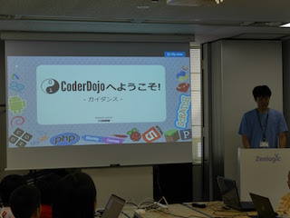
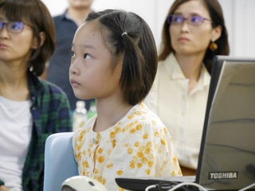
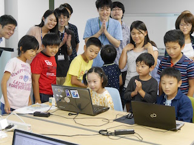
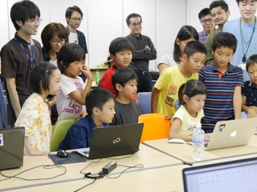

10 月 2 日(日)、CoderDojo 本町の記念すべき 1 回目を開催しました！  
初の開催にも関わらず、10 名のニンジャたちと保護者の皆様に参加して頂きました。

[子ども向けプログラミング道場：コーダー道場 1 回目@本町](https://manage.doorkeeper.jp/groups/coderdojo-hommachi/events/51789)

今回の会場は[ファーストサーバ株式会社](https://www.firstserver.co.jp/)様にお借りしました。ありがとうございました！

## 当日のスケジュール

| 時間                   | 内容                              |
| ---------------------- | --------------------------------- |
| 14:00 - 14:10 (10 min) | オープニング                      |
| 14:10 - 15:10 (60 min) | Scratch ワークショッップ          |
| 15:10 - 15:30 (20 min) | 休憩(おやつのじかん)              |
| 15:30 - 16:00 (30 min) | Scratch エンジョイ プログラミング |
| 16:00 - 16:20 (20 min) | Scratch ライトニングルック        |
| 16:20 - 16:30 (10 min) | クロージング                      |

## レポート

### オープニング

まずはチャンピオンの尾篭さん[@ogom](https://twitter.com/ogomr)より _CoderDojo ガイダンス_ のスライドを使って  
CoderDojo の理念や楽しみ方についての説明を行いました。

<iframe src="//www.slideshare.net/slideshow/embed_code/key/FAXoW4pBq172mQ" width="425" height="355" frameborder="0" marginwidth="0" marginheight="0" scrolling="no" style="border:1px solid #CCC; border-width:1px; margin-bottom:5px; max-width: 100%;" allowfullscreen> </iframe> 
 <strong> <a href="//www.slideshare.net/togazo/coderdojo-introduction-jp" title="CoderDojoガイダンス（最新版）" target="_blank">CoderDojoガイダンス（最新版）</a> </strong> from <strong><a href="//www.slideshare.net/togazo" target="_blank">K. Toga.</a></strong> 

### Scratch ワークショップ

オープニングのあとは、ビジュアルプログラミングツールの Scratch を使って  
簡単なゲームを作るワークショップの時間です。

引き続きチャンピオンが解説する資料の流れに沿って、少しずつ作り上げていきます。

約 1 時間の予定を若干オーバーしてしまいましたが  
皆さんに Scratch を使った作品の作り方を体験してもらいました。

### おやつのじかん

待ちに待ったおやつタイム！

今回のおやつは、[和紅茶とハーブティーのお店『美龍（みりゅう）』](https://www.facebook.com/Milieu-%E7%BE%8E%E9%BE%8D-%E5%92%8C%E7%B4%85%E8%8C%B6%E3%81%A8%E3%83%8F%E3%83%BC%E3%83%96%E3%81%AE%E3%81%8A%E5%BA%97-%E5%A4%A7%E9%98%AA%E5%B8%82%E4%B8%AD%E5%A4%AE%E5%8C%BA%E8%B0%B7%E7%94%BA%E4%B8%83%E4%B8%81%E7%9B%AE-1474065659551199/)さんからご提供頂きました。  
みんなで美味しく食べました！

みんなおやつに向かってダッシュ……と思いきや...  
モクモクと作品作りに熱中するニンジャもいて、個性が光る場面でした。

おやつと一緒に用意していたステッカーも大人気でした！
特に光りモノ系 w

### Scratch エンジョイプログラミング

残った時間を使って、ワークショップで作った作品を磨いていきます。  
うまく動かなかった部分を直したり、お気に入りのキャラクターで画面を埋め尽くしたり  
思い思いに作り込んでいました。

途中、ひとりのニンジャが作品に音声を付けられるようになると  
瞬く間に他のニンジャにも伝搬していったのが印象的でした。  
子どものコミュニケーション能力は本当にすごい！

### Scratch ライトニングルック

出来上がった作品を、みんなでパソコンの画面をのぞきこむ形で発表してもらいました。

同じ _Collect gems_ がベースなのに、それぞれ全く違う作品になっていて非常に盛り上がりました。

## ふりかえり

- ニンジャ・メンターも自己紹介をしたり、名札のようなものがあればよかった。
- 開始前に 30 分くらい、Scratch の準備ができていない人向けにセットアップをサポートする時間があればよかった。
- ペッパーとおやつの時間は、ニンジャ・メンターも楽しい雰囲気になってよかった。

