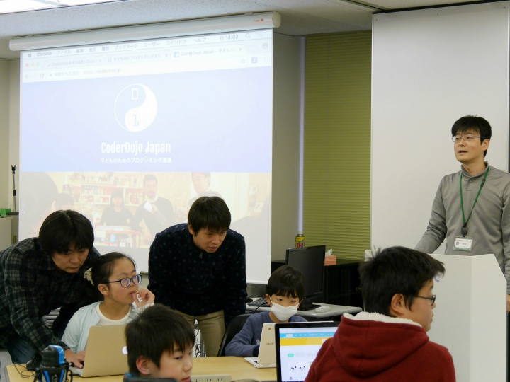
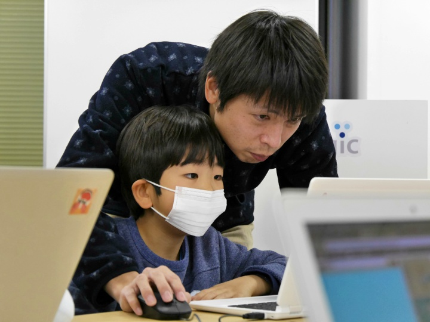
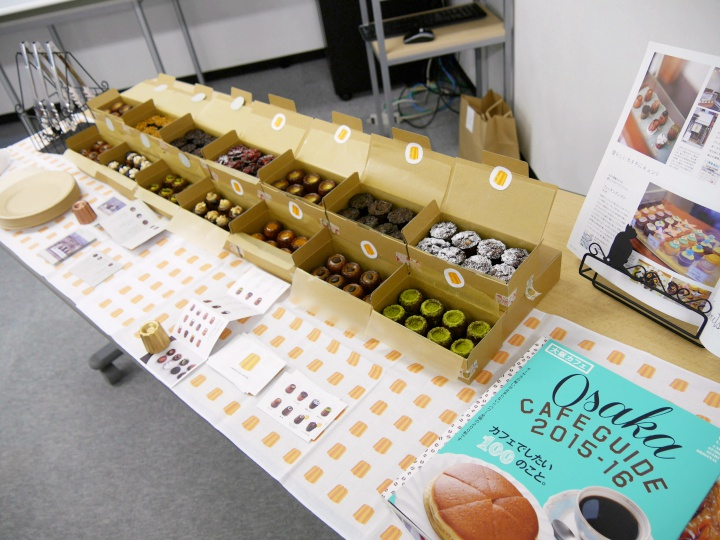
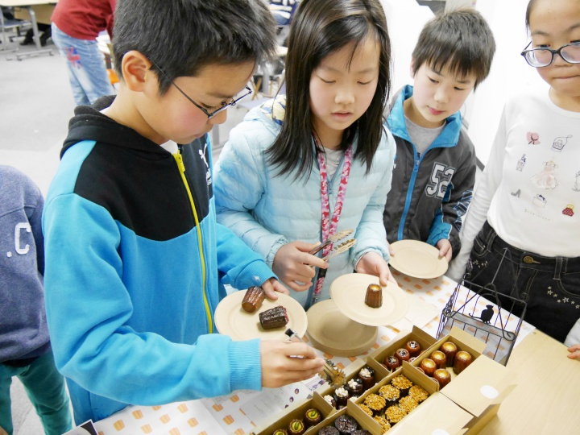
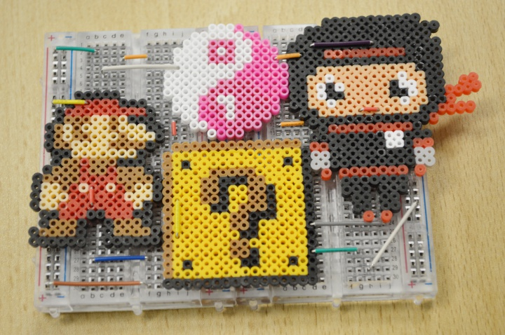
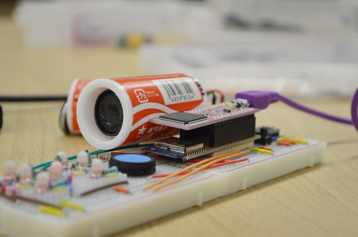
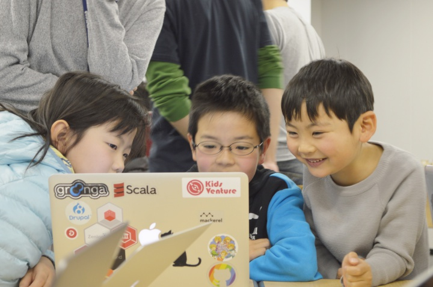
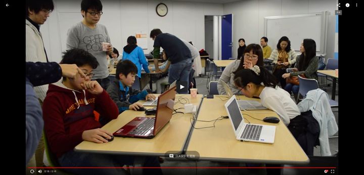
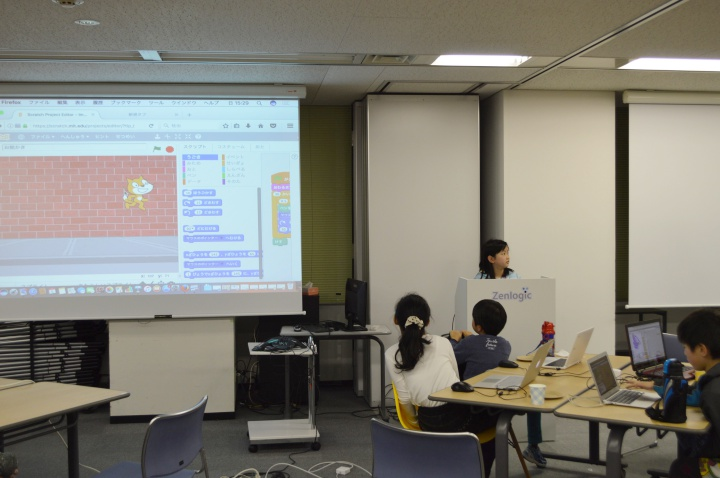
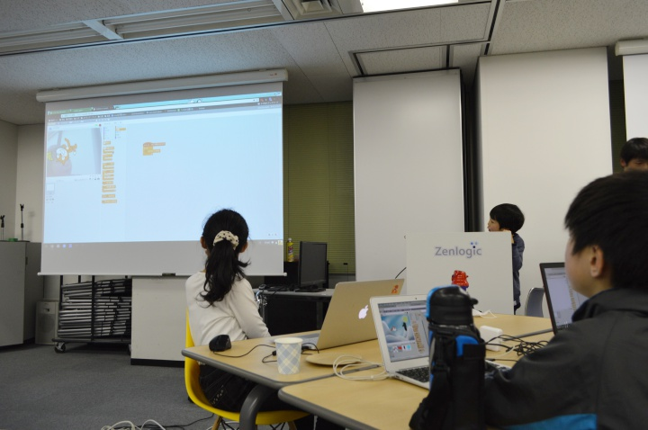

[子ども向けプログラミング道場：コーダー道場 4 回目@本町](https://coderdojo-hommachi.doorkeeper.jp/events/56121)

`9`名の **ニンジャ** と`10`名の **メンター** が集まりました。

さらに今回はカヌレエバンジェリストとロビイにもご参加いただきました！

今回も会場は[ファーストサーバ株式会社](https://www.firstserver.co.jp/)様にお借りしました。ありがとうございました！

## 当日のスケジュール

| 時間                   | 内容                 |
| ---------------------- | -------------------- |
| 14:00 - 14:10 (10 min) | オープニング         |
| 14:10 - 15:00 (50 min) | プログラミング       |
| 15:00 - 15:20 (20 min) | 休憩(おやつのじかん) |
| 15:20 - 15:50 (30 min) | プログラミングの続き |
| 15:50 - 16:10 (20 min) | ニンジャの作品発表   |
| 16:10 - 16:20 (10 min) | メンターの作品発表   |
| 16:20 - 16:30 (10 min) | クロージング         |

## レポート

### オープニング

今日やりたいことをニンジャに確認しました。今回はみんな Scatch が良かったようですね。

何をつくろうかまずはメンターと相談です。後ろでは保護者の方向けに CoderDojo の紹介も行いました。

### プログラミング

オープニングの後はプログラミングの時間です。

今回はみんな Scratch がしたいということで、各ニンジャが思い思いのプログラミングをしていきました。

はじめは場の雰囲気や、はじめて会うひとたちに緊張していたようですが、時間がたつにつれて徐々に慣れてきたようです。

CoderDojo 本町では初めてのニンジャ用に「宝石あつめ」という教材を準備していますが、今回は全員が教材なしで自分のつくりたいものをつくっていきました。すごい！

ニンジャたちは、いろいろな質問をメンターに投げかけ、自分で考え...を繰り返しながら、思った通りに作れるようにたくさん悩んでいるようでした。

### おやつのじかん

15 時になったら、休憩とおやつの時間です。
今回のおやつはなんとカヌレ！！！

ババーン！！！と登場です。

こどもたちに大人気！

たくさん準備をいただいたので、ニンジャだけでなく保護者の方やメンターたちも美味しくいただきました！

おやつの後は、ロビイやメンターの私物、電子工作などにふれて遊びました。

PPAP 再生中 ♪

### プログラミングの続き

休憩後も Scratch の続きです。

みんな打ち解けてきていい感じになってきました。

今回は動画も撮ってみました。
短い時間の動画ですが、雰囲気は伝わるかと思います。

[動画 1](https://goo.gl/photos/4cEgV5SWYzy2hper5)

[動画 2](https://goo.gl/photos/ch1DcDcG8EW8B5yo6)

### ニンジャの作品発表

今回は会場の設備をお借りできたため、希望するニンジャが前に出てプロジェクターで作品を発表しました。

大人顔負けの超大作！

舞台がとても大きく見えます！

前に出て発表することに、保護者の方が驚く場面も！

今回は４人のニンジャが発表してくれました。

### メンターの作品発表

メンターも負けじと。この日のために準備していた Scratch のゲームを披露しました。

さすがの大人感。

ただ、発表したメンターは「こども達すごい！」と感心していました。

### クロージング

最後はロビイや３Ｄゴーグルなどでみんなで遊びました。

やっぱりみんなこういうもの好きですね！

大人もこどももみんなで楽しみました。

## さいごに

今回も楽しく CoderDojo 本町を終えることができました。

人数が少し多くなり、はじめは緊張感もありましたが。
こども達はすぐに慣れてしまって思い思いに楽しんでいたようでした。

こども達の作品は大人たちが考えもつかないようなものがたくさんあり、メンターとしてもとても楽しい時間を過ごせました。

今後もたくさんの刺激的な作品に出会えることを楽しみにしています！

次回も、ご参加お待ちしております！
