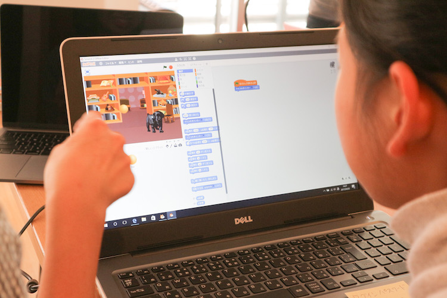
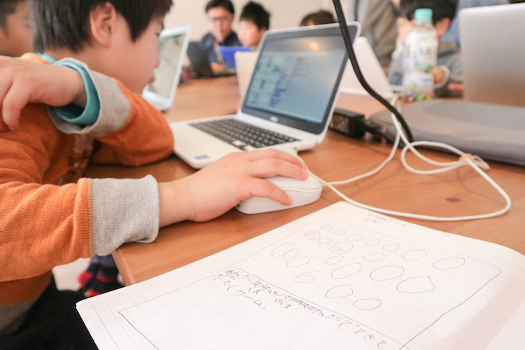
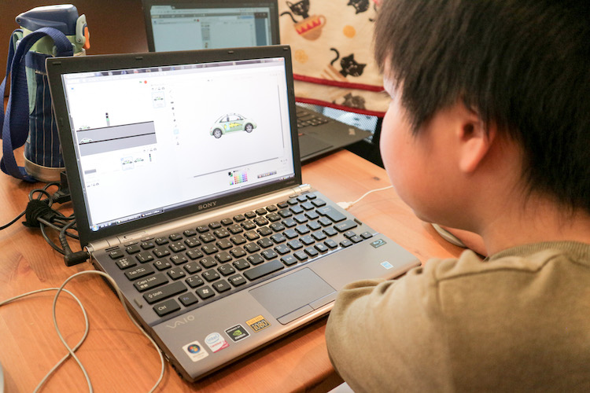
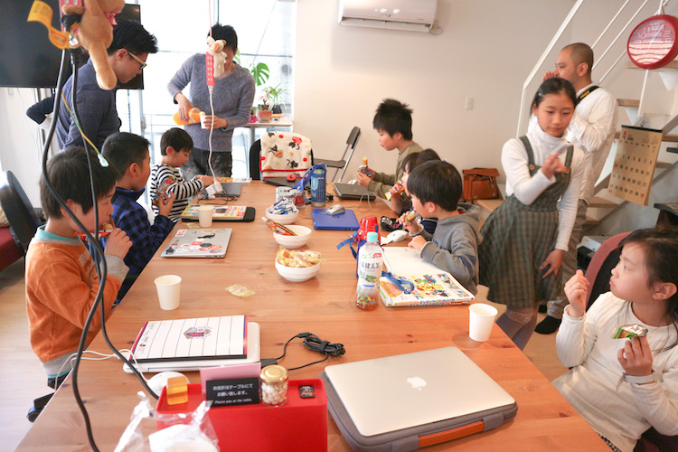
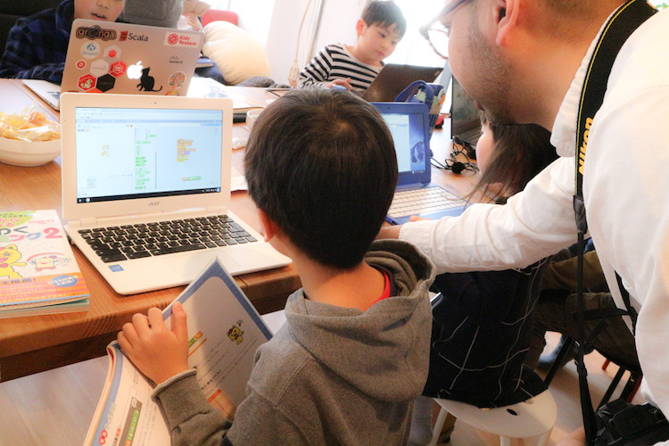
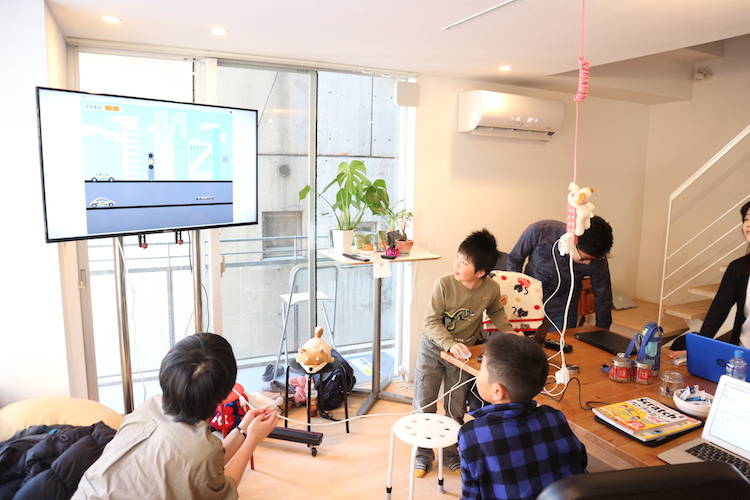
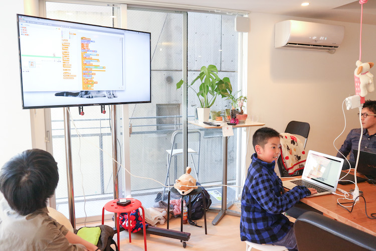
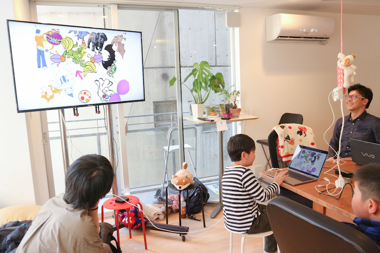

[子ども向けプログラミング道場：コーダー道場 5 回目@本町](https://coderdojo-hommachi.doorkeeper.jp/events/58239)

`8`名の **ニンジャ** と`6`名の **メンター** が集まりました。

今回の道場は[株式会社 chatbox](https://chatbox-inc.com/about/)様にて開催させていただきました！ありがとうございました！

## 当日のスケジュール

| 時間                   | 内容                 |
| ---------------------- | -------------------- |
| 14:00 - 14:10 (10 min) | オープニング         |
| 14:10 - 15:00 (50 min) | プログラミング       |
| 15:00 - 15:20 (20 min) | 休憩(おやつのじかん) |
| 15:20 - 15:50 (30 min) | プログラミングの続き |
| 15:50 - 16:10 (20 min) | ニンジャの作品発表   |
| 16:10 - 16:30 (10 min) | クロージング         |

## レポート

### オープニング

今回のニンジャは、みんな Scratch をしたいようでした。
Scratch 慣れっ子のニンジャが多く、さっそく PC を立ち上げてプログラミング開始しました。

### プログラミング

プログラミングの時間ではニンジャが Scratch を使って自由に好きなモノを作っていました。
Scratch ネコも応援。

 

Scratch はじめてのニンジャはメンターさんのサポートを受けて、「宝石あつめ」ゲームづくりに挑戦していました。

あらかじめ、作りたいゲームの計画を紙に書いているニンジャもいました。

迷路ゲームづくりに挑戦するニンジャもいたり。

ゲームづくりのプログラミングだけでなく、車のデザインもしっかり作り込むニンジャも！

どのニンジャの画面を見てもそれぞれ全然作りたいモノが違っていて、みんな個性が光っていました。ステキ！

### おやつのじかん

15 時になったら、休憩とおやつの時間です。
今回のおやつは チョコパイとアルフォートとうまい棒です ♪

うまい棒、とても人気でした！

### プログラミングの続き

休憩後も Scratch の続きです。

わからないところは本を読んでがんばってみたり、メンターさんと協力したりしてみんなどんどん作り上げていきます。

はじめてのニンジャも打ち解けてきて、すっかり楽しそう！

### ニンジャの作品発表

希望するニンジャが前に出て、テレビに作品を移し発表しました。
今回も元気よくたくさんの手が上がりました！積極的なニンジャが多くてびっくりです！

作りたいゲームをしっかり仕上げていました！

 

ステージや車、音もしっかりと作り込まれていて本当のゲームのようでした！すごいです！

 

マリオのゲームな動きを再現していました！たくさんのプログラミングを上手に組み合わせていました！

 

楽しげな音楽とともに、たくさんのキャラクターが動いていました！ニンジャのセンスが眩しいです！

 

はじめて Scratch 挑戦したニンジャも「宝石あつめ」ゲームを完成させて発表してくれました！

 

自分の番が回ってくるギリギリまでがんばっていたニンジャ！難易度のたかそうな「迷路ゲーム」は力作でした！

 

どのニンジャの作品もとっても完成度が高く、大人顔負けのものばかりで、すばらしかったです！

## さいごに

今回の CoderDojo も楽しく、無事に終えることができました。

ニンジャたちから学ぶことがたくさんあったように思います。
私もまだまだがんばらねばと、たくさん元気をもらいました。

参加してくれたニンジャ、保護者の皆様、ご協力くださったメンターの方々、ありがとうございました！

ぜひ、次回のご参加もお待ちしております！
そして、新しいニンジャとも出会えることを期待しています！
