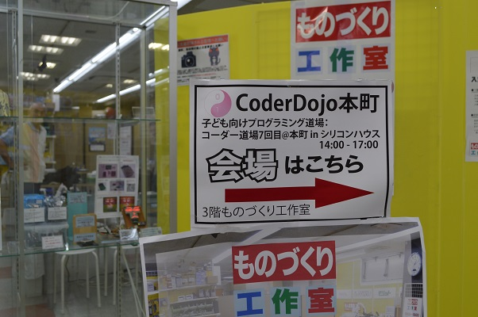
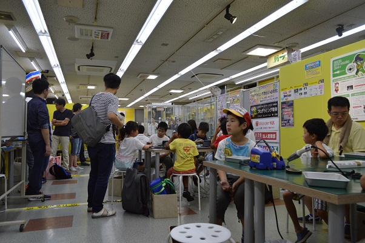
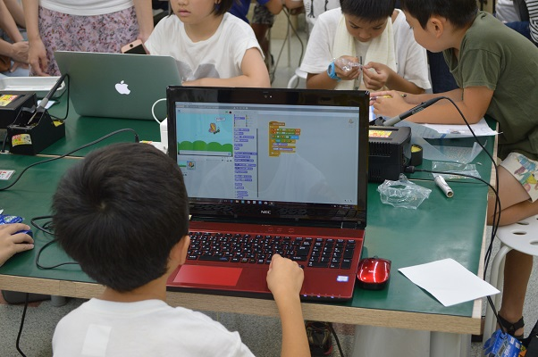
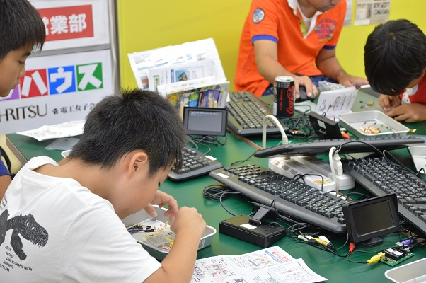
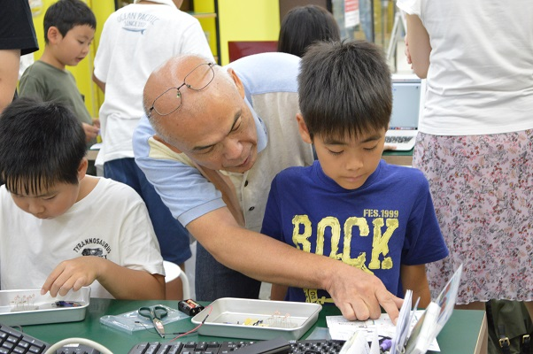
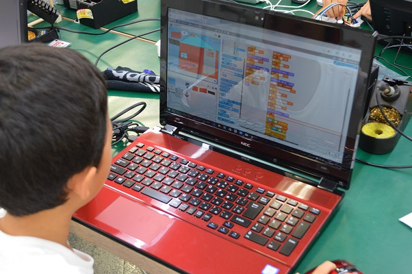
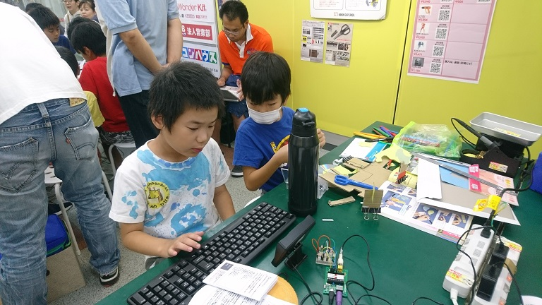
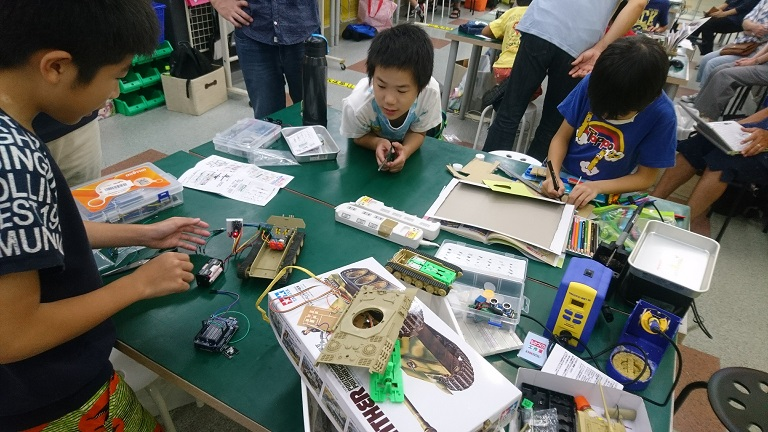
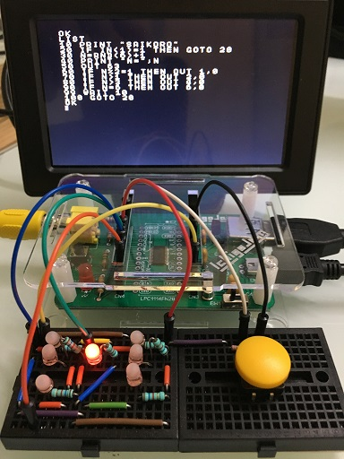

[子ども向けプログラミング道場：コーダー道場 7 回目@本町](https://coderdojo-hommachi.doorkeeper.jp/events/63270)

`15`名の **ニンジャ** と`7`名の **メンター** が集まりました。

今回の道場は IchigoJam, Arduino, RaspberryPi や電子工作キットも売ってて、電子工作ならなんでも揃う[シリコンハウス](http://silicon.kyohritsu.com/)様の 3F「[ものづくり工作室](http://silicon.kyohritsu.com/monodukuri.html)」にて開催させていただきました。ありがとうございました！

## 当日のスケジュール

今回は電子工作も出来る場所での開催なので、健康面もあり「おやつのじかん」はがまんです。

| 時間                   | 内容                                         |
| ---------------------- | -------------------------------------------- |
| 14:00 - 14:15 (15 min) | オープニング                                 |
| 14:15 - 15:00 (45 min) | プログラミング・電子工作・工作：前半         |
| 15:00 - 15:20 (20 min) | 休憩                                         |
| 15:20 - 15:30 (10 min) | 電子工作(電子サイコロ)のプログラミングの説明 |
| 15:30 - 16:20 (50 min) | プログラミング・電子工作・工作の続き：後半   |
| 16:20 - 16:30 (10 min) | クロージング                                 |

## レポート

### オープニング

今回の夏休み後半ということもあり、電子工作や自由研究の工作、Scratch など色んなニンジャが来てくれました！

電子工作をするニンジャは、今回電子サイコロを作成します。
最初にメンターから LED の光らせ方や、ケガをしないように気をつける部分などを教えてもらってから製作開始です。

### 前半：プログラミング・電子工作・工作

Scratch でプログラミングをしたいニンジャ達は早速自分たちの作りたいものに取りかかってました。

わからないところが出てくればメンターをつかまえて、色々教えてもらいながらプログラミングしていきます。

電子サイコロを作りたいニンジャたちは、回路図とにらめっこしながら一つずつ部品をつなげていきます。

みんなすごい集中力。

質問する一生懸命なニンジャに、メンターも熱がこもります。

夏休みの自由工作をするニンジャも、電子工作をするニンジャと一緒に作品を作っていました。

### 休憩

午後３時からはひとまず休憩なんですが、みんな没頭してあっという間に後半へ突入

### プログラミング・電子工作・工作：後半

Scratch のプログラミングも後半に入り、色々と工夫が入っていきます。

どんな作品になるのかな？

電子サイコロを作るニンジャは、プログラミングで LED の光らせ方をメンターに教えてもらって、プログラミング開始！ボードはニンジャによって IchigoJam と RaspberryPi を選んでプログラミングします。

夏休みの自由工作を作ってるニンジャも気になる様子。

Scratch のプログラミングも、工作もラストスパートです。

電子サイコロのプログラミングが出来ても、思うように動かないニンジャもいて、メンターが一緒に原因をさがします。

メンターがボードを交換したりして、一つずつ一緒に確認していき、最後には電子工作をするニンジャはみんなサイコロが出来るようになりました。

よかったー

電子サイコロの作成を早めに終わったニンジャは、次のむずかしい電子工作にとりかかってました。

これにはメンターもびっくり。調べながらサポートする一面もあったりと、メンターにとっても刺激的な時間です。

### クロージング

今回の CoderDojo 本町も、最後まで楽しい空間で無事に終えることが出来ました。

ニンジャの「作りたい！」の意欲は本当にすごいです。失敗なんて何のそのです。
そんなニンジャから今回もたくさんの元気をもらいました。

ニンジャの作品の方向性もどんどん多様化してて、私達メンターも負けてられないなと思いました。

今回参加してくれたニンジャのみんな、保護者様、ご協力下さったメンターの方々、ありがとうございました！次回のご参加もお待ちしております。

また来てね :-)

