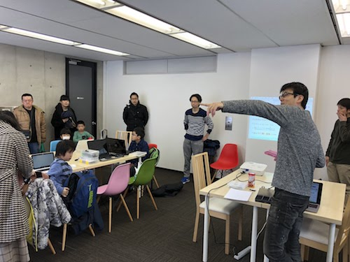
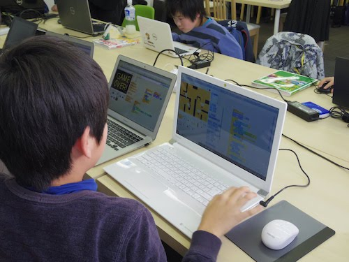
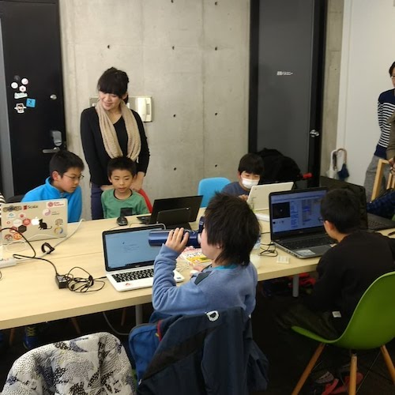
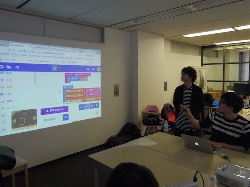
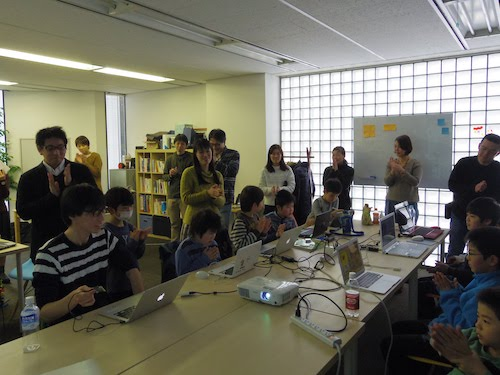

[子ども向けプログラミング道場：コーダー道場 10 回目@本町](https://coderdojo-hommachi.doorkeeper.jp/events/69542)

`11`名の **ニンジャ** と`10`名の **メンター** が集まりました。

今回の Dojo は「[株式会社ソウ](https://sou-co.jp/)」にて開催させていただきました。

## 当日のスケジュール

| 時間                   | 内容                 |
| ---------------------- | -------------------- |
| 13:00 - 13:15 (15 min) | オープニング         |
| 13:15 - 14:00 (45 min) | プログラミング       |
| 14:00 - 14:15 (15 min) | 休憩                 |
| 14:15 - 15:00 (45 min) | プログラミングの続き |
| 15:00 - 15:30 (30 min) | 作品発表             |
| 15:30 - 15:40 (10 min) | クロージング         |

## レポート

### オープニング

今回は scratch をメインで作りたいニンジャがたくさん来てくれました。 保護者の方も合わせると 30 人ぐらいの方が集まりました。
 

### プログラミング

開始から黙々と作業に取り掛かるニンジャたち。

---

とても集中して作業に取り組んでいました。

### 休憩

ニンジャたちは scratch に夢中でほぼ休憩なしで後半の作業へ…

### プログラミングの続き

---

ニンジャ同士でアドバイスしあったりお互いの作品を楽しそうにプレイしていました。

### 作品発表

いよいよ作品発表！

---

希望するニンジャが前に出てプロジェクターで作品を発表しました。

どこかで見たことがあるようなキャラクターも登場。 
クイズゲームで盛り上がりました。

---

マイクロビットを使った作品の紹介も行われました。

---

今回はニンジャ同士が意見交換をして作業を進めていく場面が多かったです。

### クロージング

参加してくれたニンジャ、保護者の皆様、ご協力くださったメンターの方々、ありがとうございました！

次回のご参加もお待ちしております！

ありがとうございました！
