[子ども向けプログラミング道場：コーダー道場 11 回目@本町](https://coderdojo-hommachi.doorkeeper.jp/events/71418)

`11`名の **ニンジャ** と`4`名の **メンター** が集まりました。

今回の Dojo は「[株式会社ソウ](https://sou-co.jp/)」にて開催させていただきました。

## 当日のスケジュール

| 時間                   | 内容                 |
| ---------------------- | -------------------- |
| 13:00 - 13:15 (15 min) | オープニング         |
| 13:15 - 14:00 (45 min) | プログラミング       |
| 14:00 - 14:15 (15 min) | 休憩                 |
| 14:15 - 15:00 (45 min) | プログラミングの続き |
| 15:10 - 15:40 (30 min) | 作品発表             |
| 15:40 - 15:50 (10 min) | クロージング         |

## レポート

### オープニング

ゴールデンウィークでもたくさんのニンジャが集まりました。みんなで写真を撮ったのでサイズが複数です。

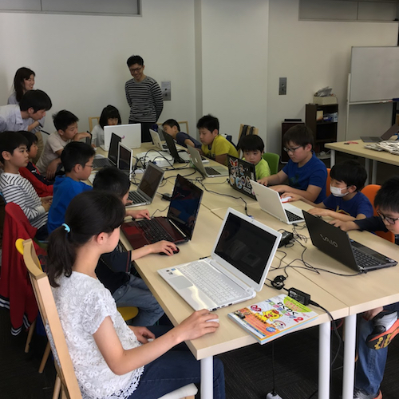

### プログラミング

ひとつのモニターを見て盛り上がったり工作に夢中になったり、ニンジャたちの創作意欲が膨れ上がります。

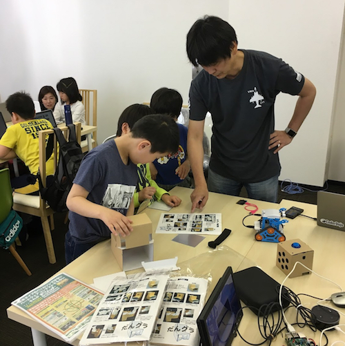

メンターに質問しながらモクモクとプログラミングしています。AI スピーカーのコーナーも人気！！

### 作品発表

発表でプロジェクターが接続できないとみんなが集合します。青鬼のゲームを再現で背景が怖いです。

プロジェクターが接続できると着席します。向かってくるモンスターを倒します。ドラゴンは変数を使って強くします。

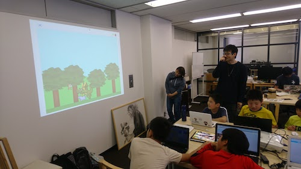

作者もクリアーできない激ムズステージで盛り上がります。8 ステージ作ったのに 4 ステージから進みません。

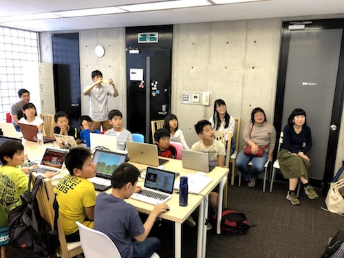

なんでも回せるハンドスピナーで白と黒を回すとカラーになると思って醤油と黒い人物を回すと...

動体視力のクイズゲームでニンジャ達は答えられるのに、大人には難しい？集中力の差かも

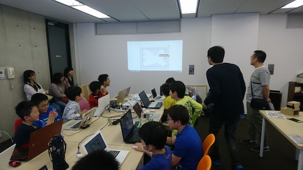
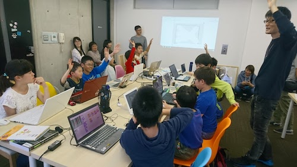

新しい武器が選択できるようになりました。タイムストップの杖はモンスターの動きが止まるので強力です。

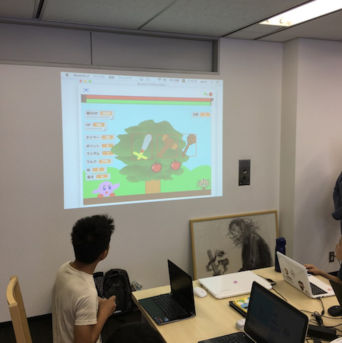

攻撃方法を再現したシューティンングのシミュレーション！攻撃方法の数が多すぎて覚えていないです。

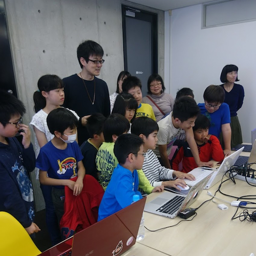

密集度が高くてよく見えませんでした。次は LEVEL5 のゲームを作るそうです。

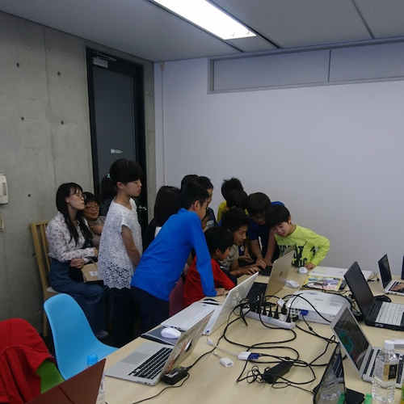

### クロージング

メンターの持ち込みのカムロボやダングラもニンジャのブレイクタイムに活躍しています。

次はカムロボのプログラミングをみんなでできるといいな！

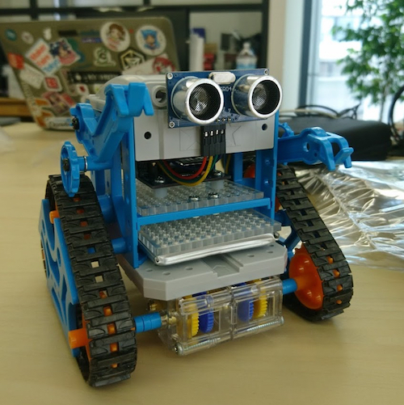
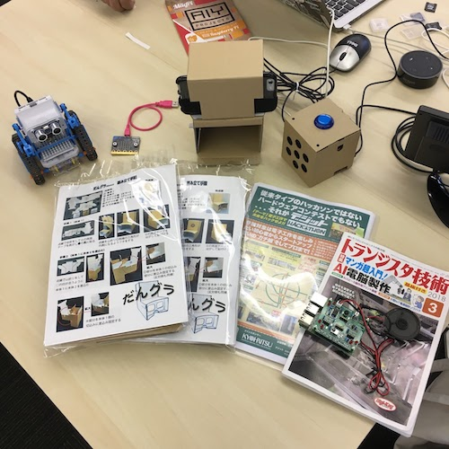
