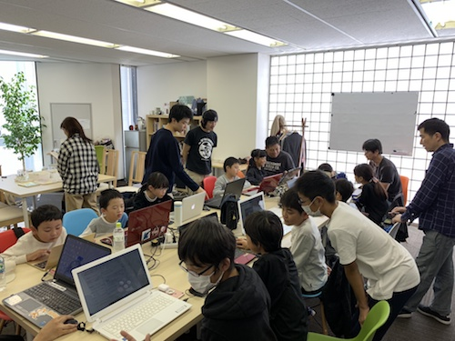
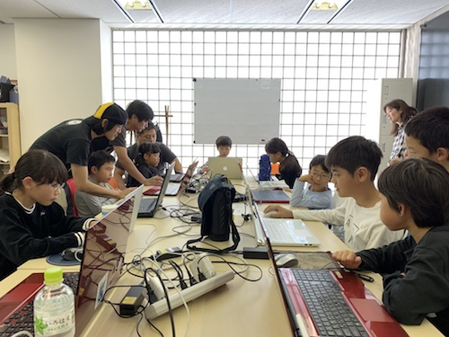
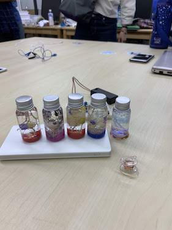
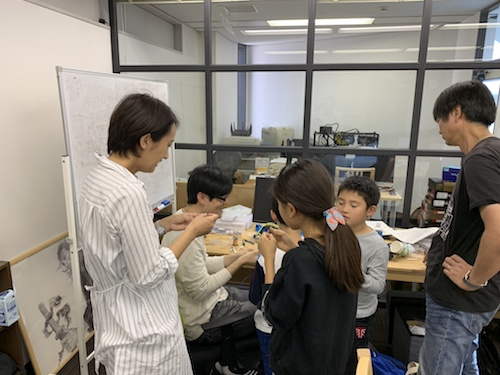
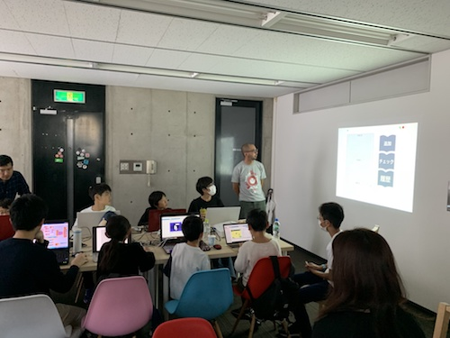
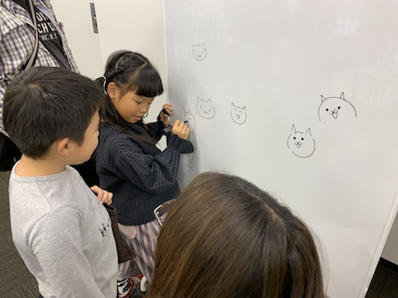
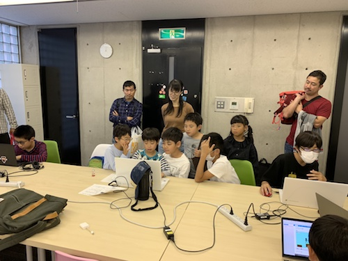

[子ども向けプログラミング道場：コーダー道場 14 回目@本町](https://coderdojo-hommachi.doorkeeper.jp/events/80282)
`6`名の **メンター** と`1`名の **ジュニアメンター** 、そして`12`名の **ニンジャ** が集まりました。

今回も「[株式会社ソウ](https://sou-co.jp/)」にて開催させていただきました！

## 当日のスケジュール ⏰

| 時間                   | 内容                              |
| ---------------------- | --------------------------------- |
| 13:00 - 13:15 (15 min) | オープニング & ワークショップ準備 |
| 13:15 - 14:00 (45 min) | プログラミング                    |
| 14:00 - 14:15 (15 min) | 休憩                              |
| 14:15 - 15:00 (45 min) | 電子工作 & プログラミングの続き   |
| 15:00 - 15:30 (30 min) | 作品発表                          |
| 15:30 - 16:00 (30 min) | クロージング                      |

## レポート 📝

### オープニング 🎉

今回はたくさんのニンジャとメンターが参加してくれました！大人数で賑やかです。

今回もプログラミングの他に電子工作も行いました 🤖

### プログラミング 👩‍💻👨‍💻

今回はみんな Scratch をやったことがあるニンジャばっかりで、みんなさっそく作り始めます！

### 休憩 🍬

今回は開催時間が短いこともあり、みんな休憩時間を忘れてわいわい楽しそうでした。

### 電子工作 & プログラミング の続き 💨

電子工作も始まりました。
今回の電子工作は光るハーバリウムとボビンスピーカーです！

光るハーバリウム。作品はどれも素敵でした。

ボビンスピーカーの説明にも力が入ります。メンター同士も質問大会 😁

### 作品発表 🚀

発表の時間がたりないくらい。みんな思い思いの発表をしてくれました。

今回は中学生のニンジャも２名参加してくれました。
本格的な内容はさすがです！

パソコンとプロジェクタがつながらなくても大丈夫。みんなでひとつのモニタを見学 👀

発表後も時間の許す限り工作やプログラミングを楽しんでいました。
公園のような雰囲気で良い感じでした ⛲

みなさまありがとうございました。
次回の開催は 12 月を予定しています 🎊
