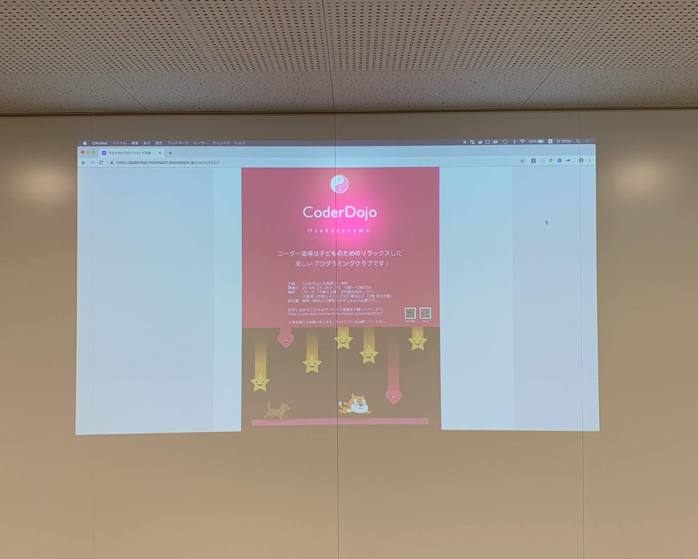
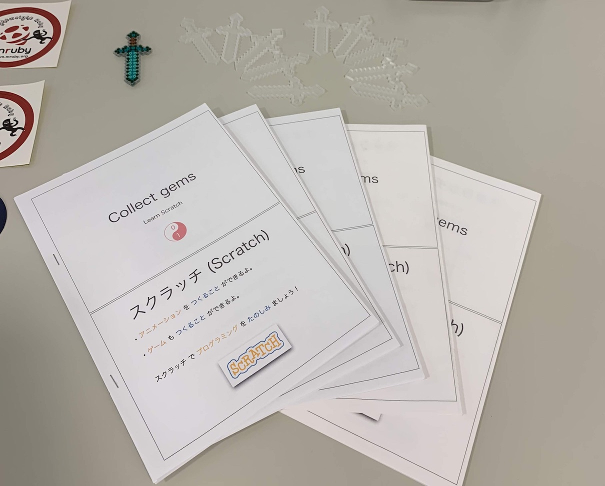
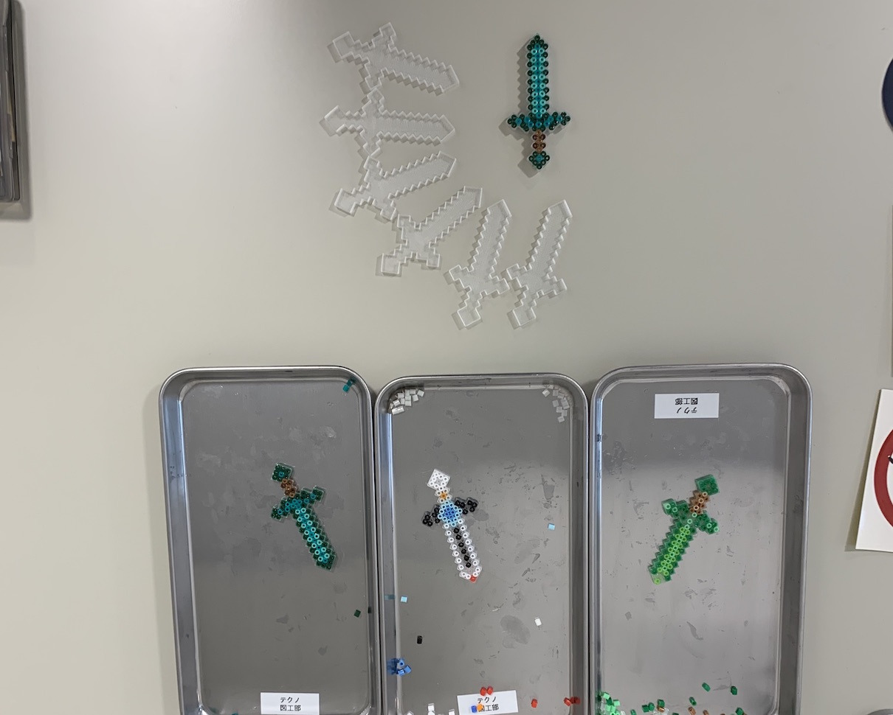
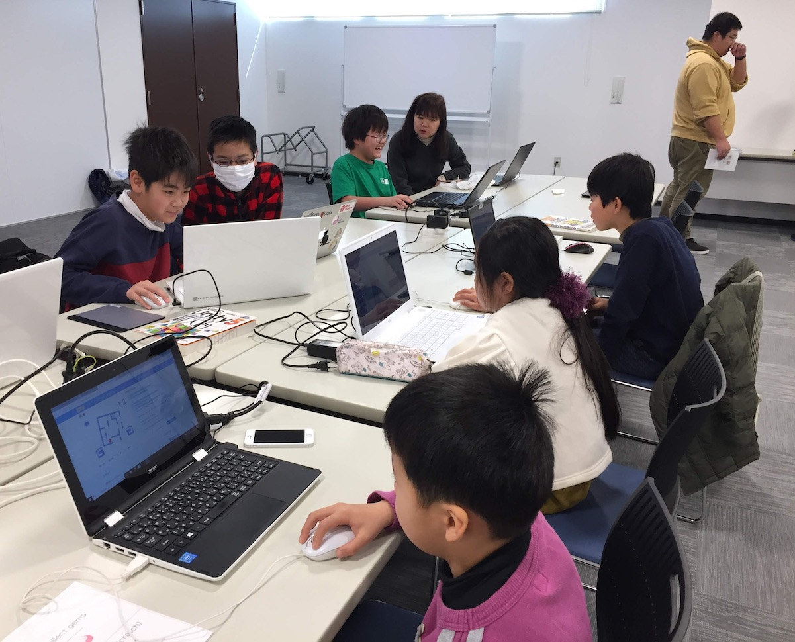
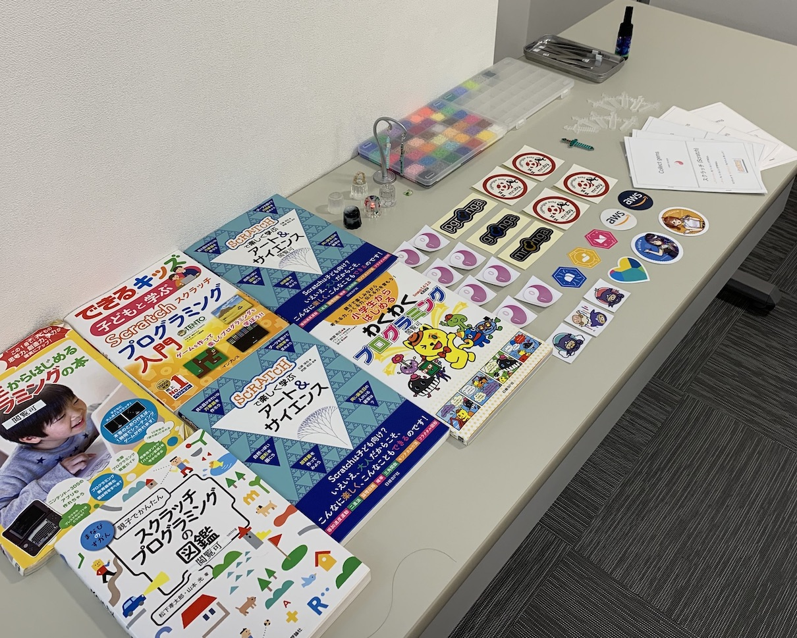
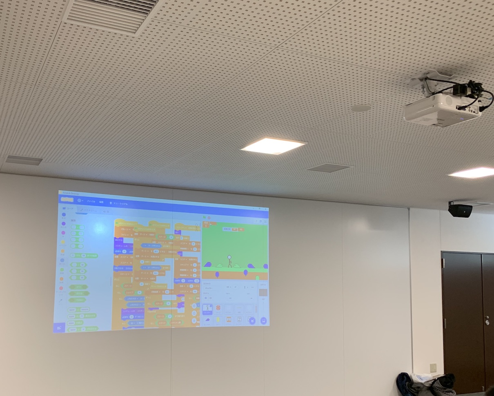
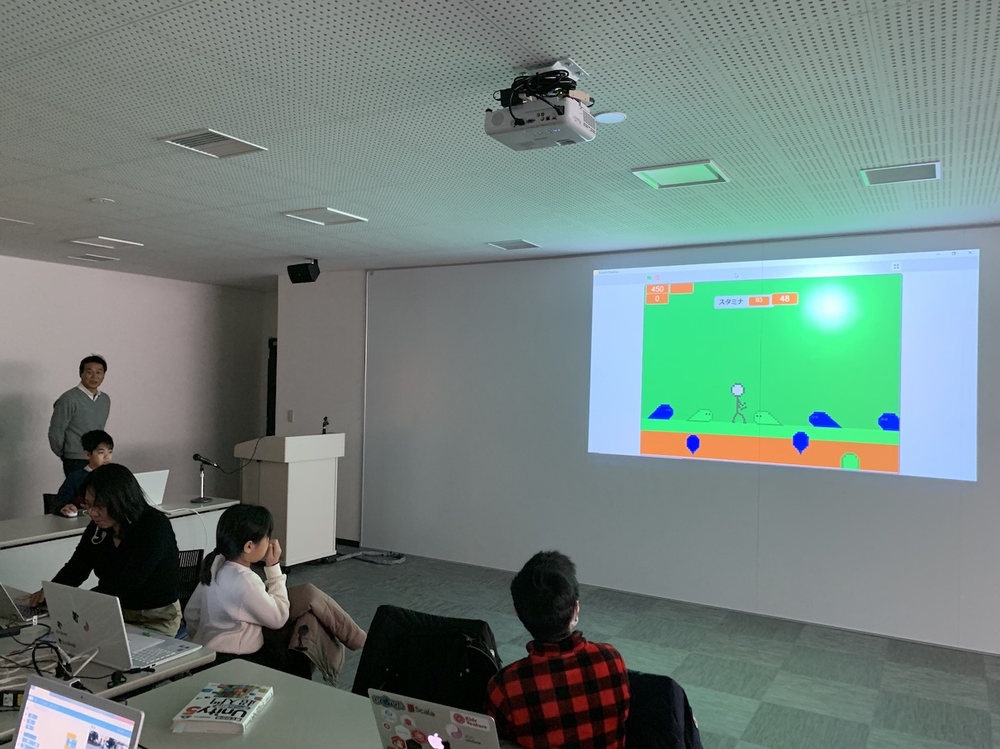
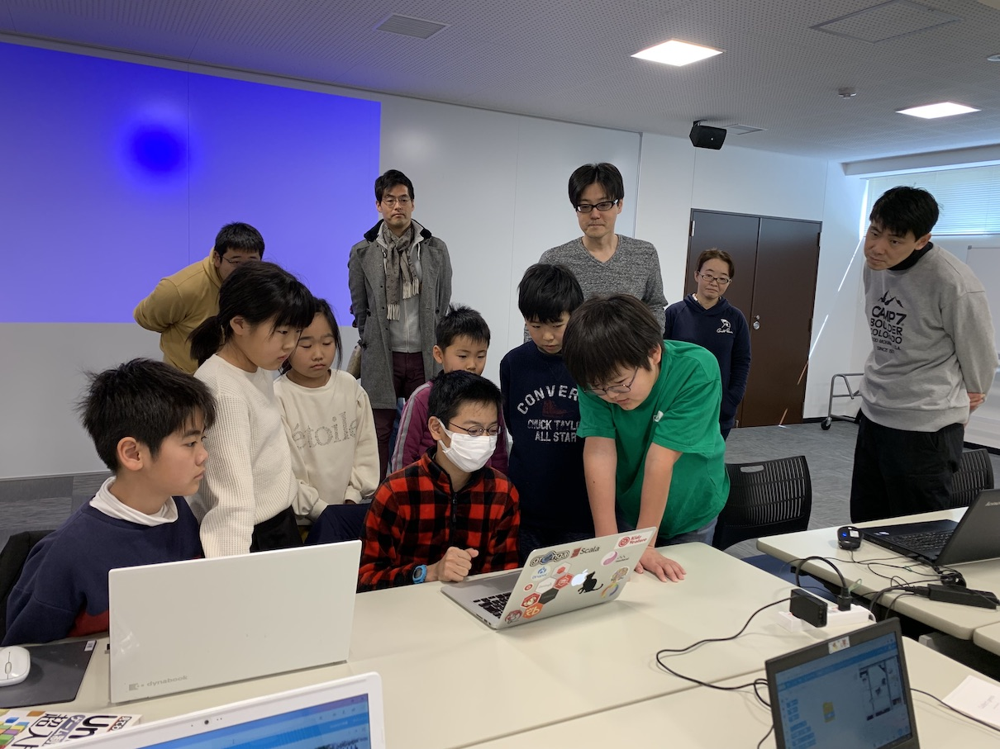
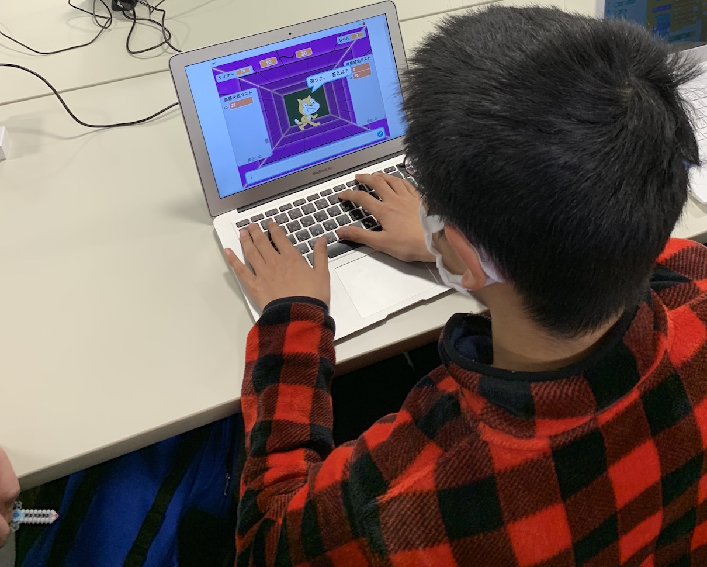

[子ども向けプログラミング道場：コーダー道場 16 回目 @大阪狭山](https://coderdojo-hommachi.doorkeeper.jp/events/86327)
`4`名の **メンター**と`9`名の **ニンジャ** が集まりました。隣街の CoderDojo 富田林 のチャンピオンも来てくれました。

会場は「[UP っぷ（子育て支援・世代間交流センター）](http://www.city.osakasayama.osaka.jp/kosodate_kyoiku/kosodate/upp_kosodatesiensedaikankouryuusenta1/index.html)」にて開催させていただきました！

## 当日のスケジュール ⏰

| 時間                   | 内容                      |
| ---------------------- | ------------------------- |
| 10:00 - 10:10 (10 min) | オープニング              |
| 10:10 - 11:10 (60 min) | プログラミング & 図工     |
| 11:10 - 11:30 (20 min) | 休憩                      |
| 11:30 - 11:50 (20 min) | プログラミングの続き      |
| 11:50 - 12:10 (20 min) | 作品発表                  |
| 12:10 - 12:30 (20 min) | クロージング & 交流タイム |

## レポート 📝

### オープニング 🎉

大阪狭山市駅の近くにコミュニティーセンターができて、その会場を借りることができたので、CoderDojo 大阪狭山が誕生しました。
はじめての参加者が多いので、CoderDojo 本町 の 1 回目でも登場した ねこの宝石集め を準備しました。

### プログラミング & 図工 👩‍💻👨‍💻

お友達と相談しあったり、メンターといっしょにプログラミングを楽しんでいます。
図工はマイクラ風のソードをビーズで作ります。ビーズは小さいけどオリジナルのドット絵ができました。

### プログラミングの続き 😁😁

図工も終わってみんなでプログラミングです。発表に向けてのアイデアをお友達と考えています。
メンターの持ち寄りで本を持ってくるので重なることもあります。アート＆サイエンスは大人も好きですね。

### 作品発表 🎤

#### 発表１

何年も作り続けている格闘ゲームです。どんどん進化をして、武器や防具や技が購入できるようになって多彩です。
こどももおとなもずっと遊んでいられるようなゲームになっています。これからも期待

#### 発表２

プロジェクターにつながらない時は、みんなが集まって発表を聞きます。
変数に格納された数字を推理をして当てるゲームです。思いついたことがすぐに表現できるのが楽しそう

コミュニティーセンターは年間スケジュールで会場を借りることができるので、今後も CoderDojo 大阪狭山 は継続的に開催することができそうです。
