[子ども向けプログラミング道場：コーダー道場 23 回目 @大阪狭山](https://coderdojo-hommachi.doorkeeper.jp/events/90144)

`2`名の **メンター**と`6`名の **ニンジャ** が集まりました。

会場は「[UP っぷ（子育て支援・世代間交流センター）](http://www.city.osakasayama.osaka.jp/kosodate_kyoiku/kosodate/upp_kosodatesiensedaikankouryuusenta1/index.html)」にて開催させていただきました

## 当日のスケジュール ⏰

| 時間                   | 内容                      |
| ---------------------- | ------------------------- |
| 10:00 - 10:10 (10 min) | オープニング              |
| 10:10 - 11:10 (60 min) | プログラミング            |
| 11:10 - 11:30 (20 min) | 休憩                      |
| 11:30 - 12:00 (30 min) | プログラミングの続き      |
| 12:00 - 12:20 (20 min) | 作品発表                  |
| 12:20 - 12:30 (10 min) | クロージング & 交流タイム |

## レポート 📝

### オープニング 🎉

今回はチャンピオンは別のイベントに参加しているので、初めてメンターのみで開催しています。

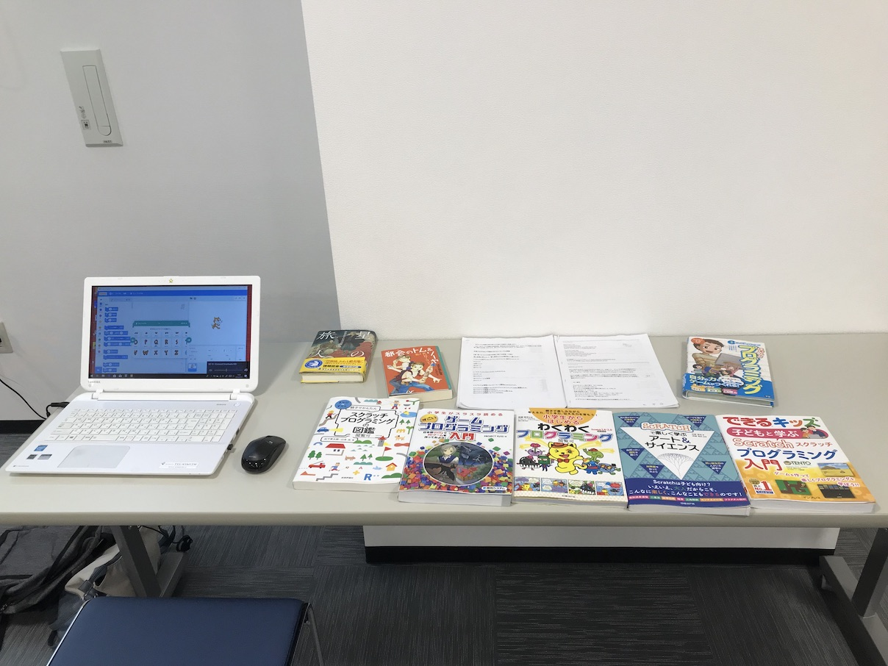

ユースメンターが各テーブルに座るフォーメイションがいいですね。

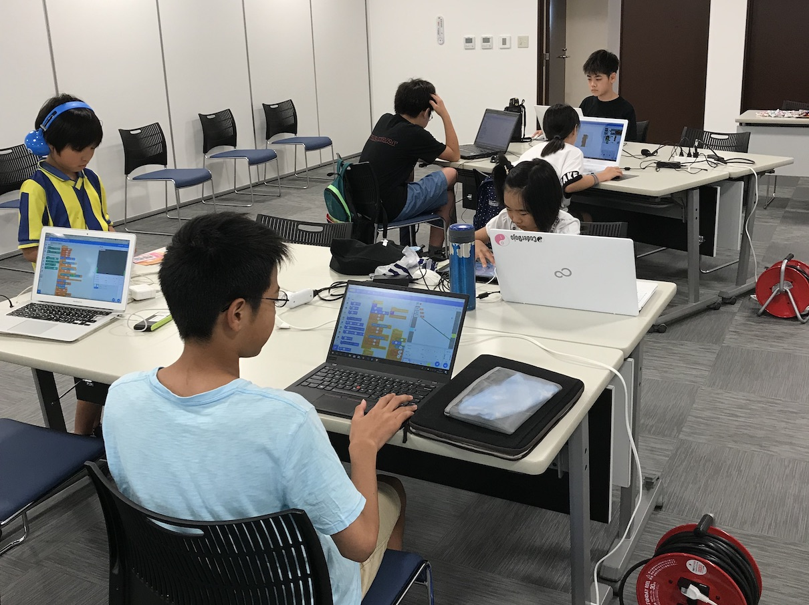

### プログラミング

プログラミングのことを相談できる友達が隣にいてくれるのは楽しそう！

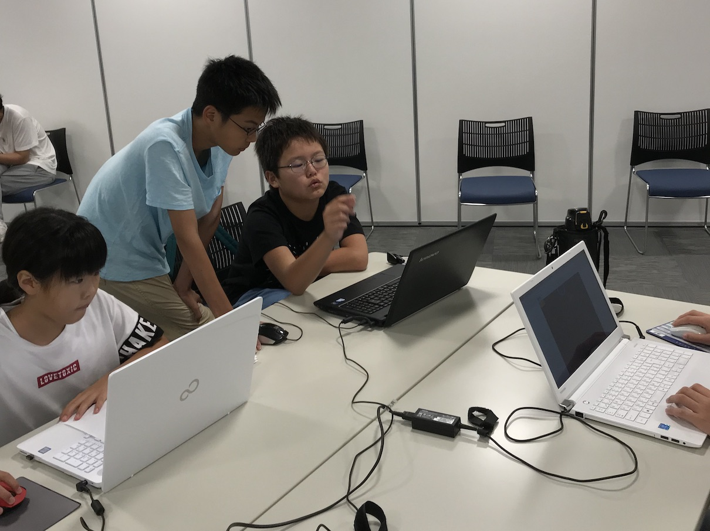

### 休憩

お菓子の持ちみが定番になってきています。でも食べきれないので帰りにみんなで分けています。🍪

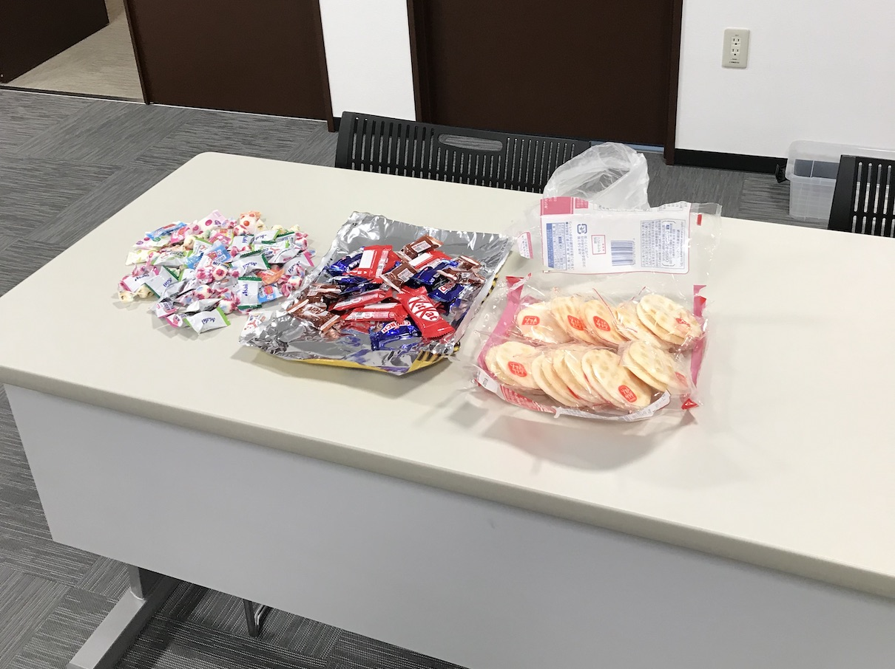

### プログラミングの続き

マイクラのキャラクターをたくさん描いてたり、スーパーマリオのような横スクロールのゲームを作っています。

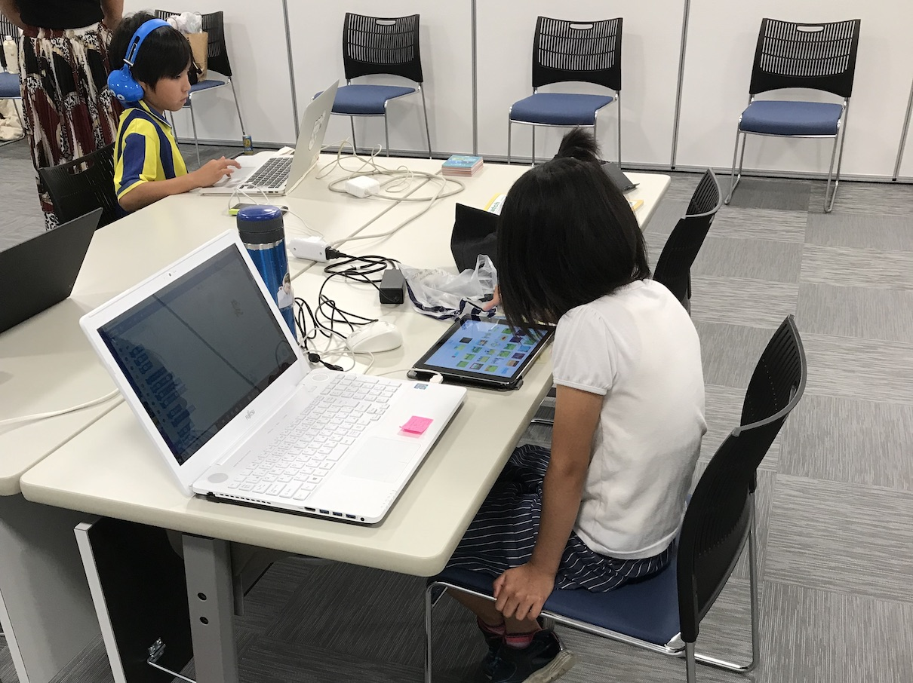

### 作品発表

#### 発表１

棒を動かして球を動かして決められた場所に入れるゲームです。

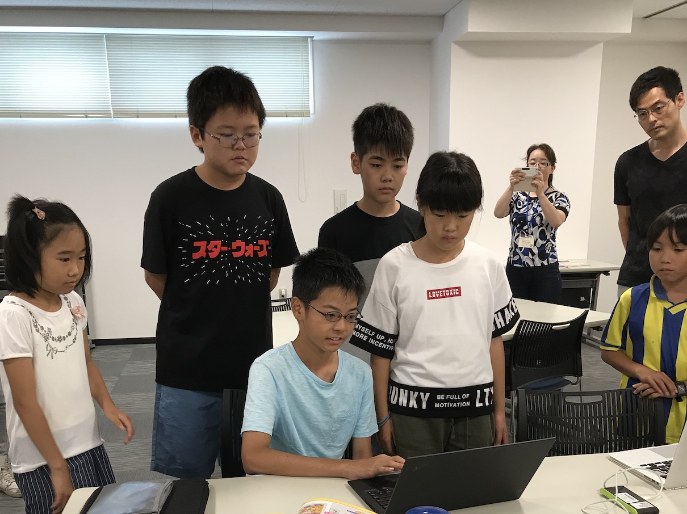

毎回ショートですが、新作を発表してくれています。

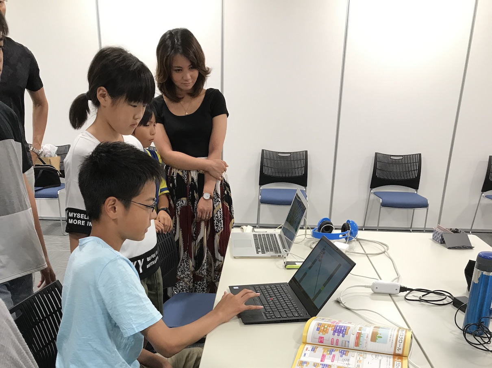

#### 発表２

パソコンにウィルスが入った時の対処方法のシミュレーションです。

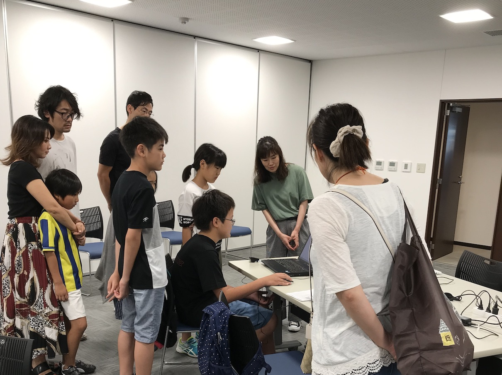

セキュリティーの研修で使えそうなくらいリアル 😎

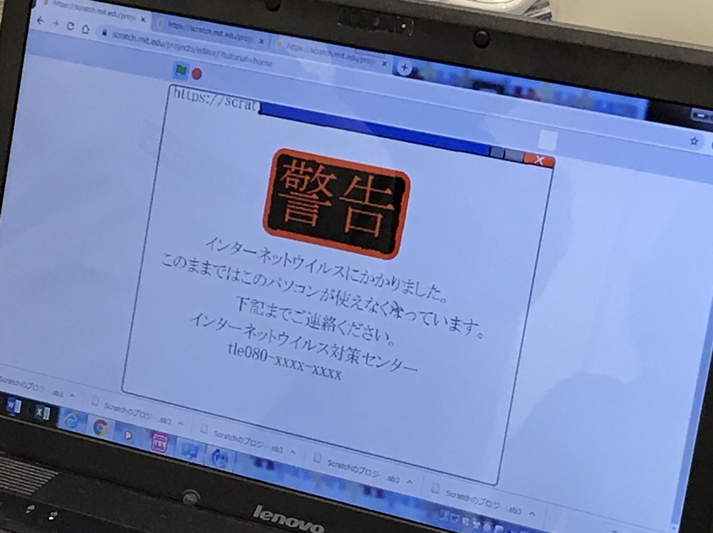

#### 発表３

いろんな背景を使ったアニメーションです。🏞

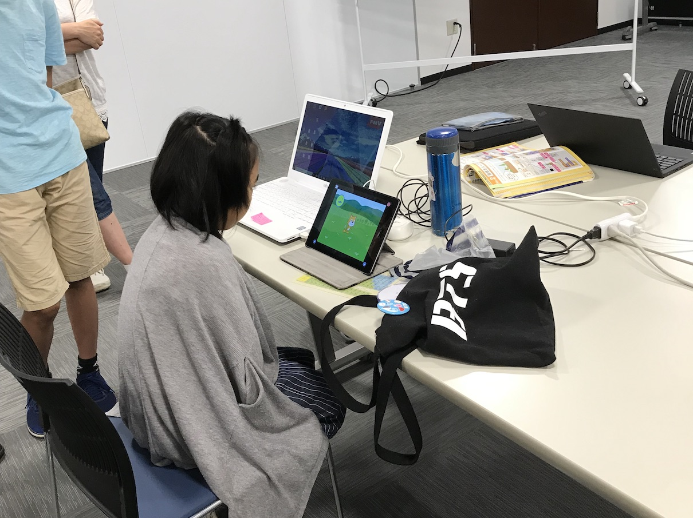

タブレットを使って作ると、作りやすかったそうです。

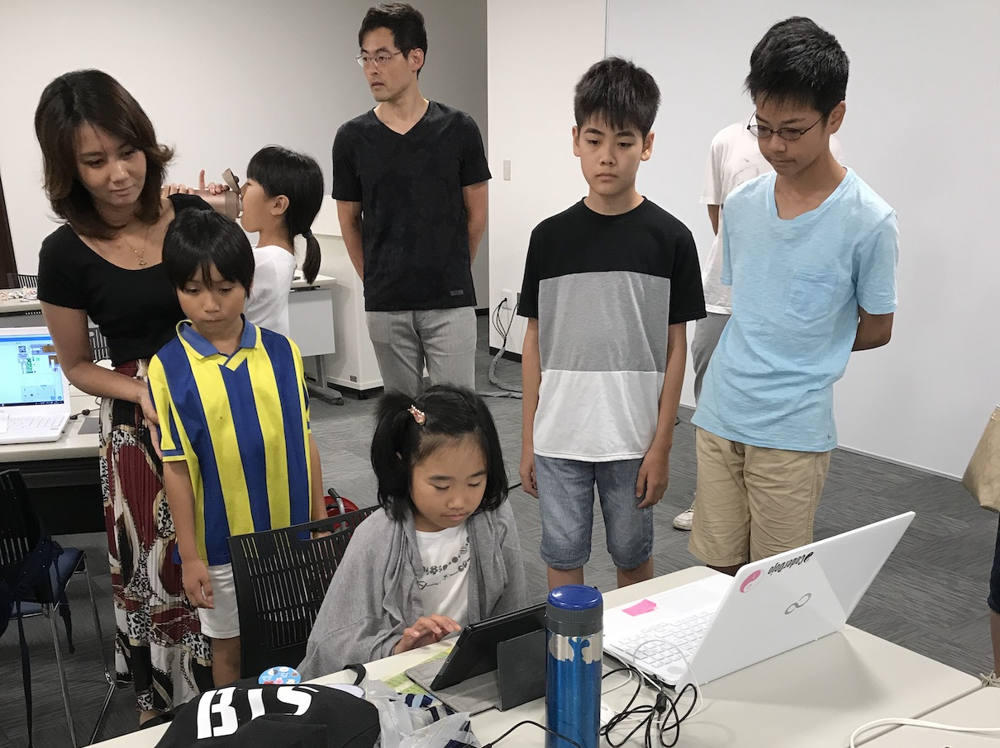

#### 発表４

周りから来る攻撃を四角い枠の中で避けるゲームです。

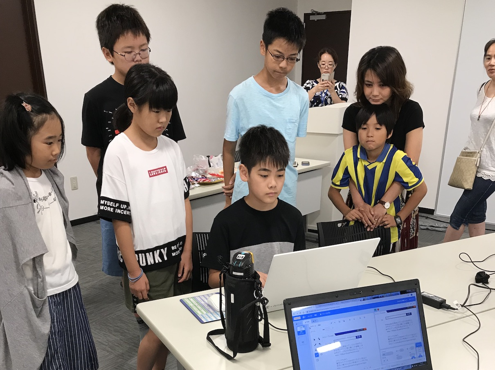

いつもながらアクションが激しいです。✨

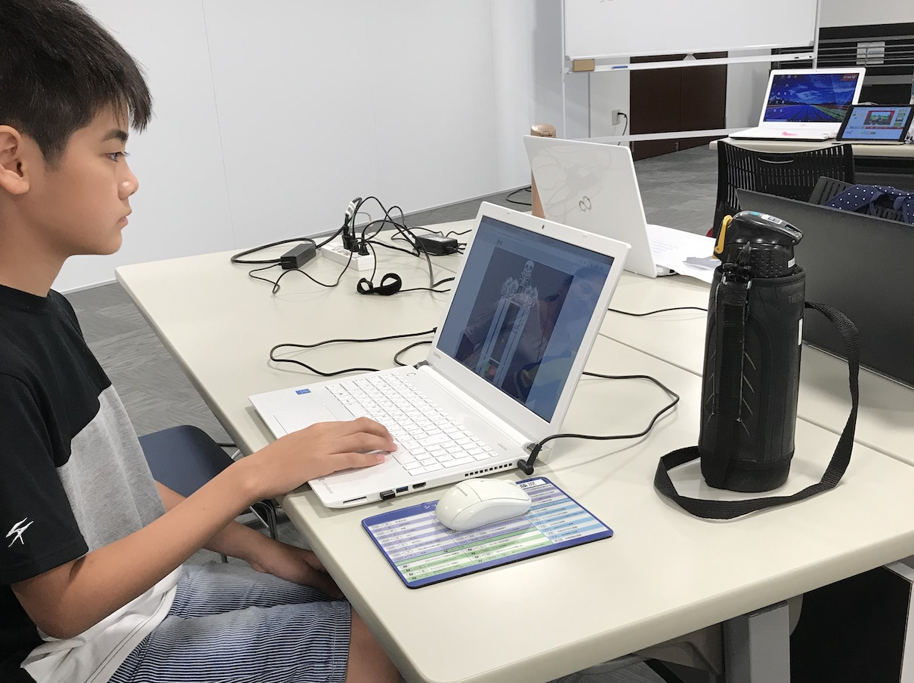

### クロージング

今回で大阪狭山は 6 回目、毎月開催で半年も続けるていると子供達は仲良くなるし、毎回参加してくれています。
本町は来月に 3 周年ですが、大阪狭山も長く続く道場であることを願っています。🙏

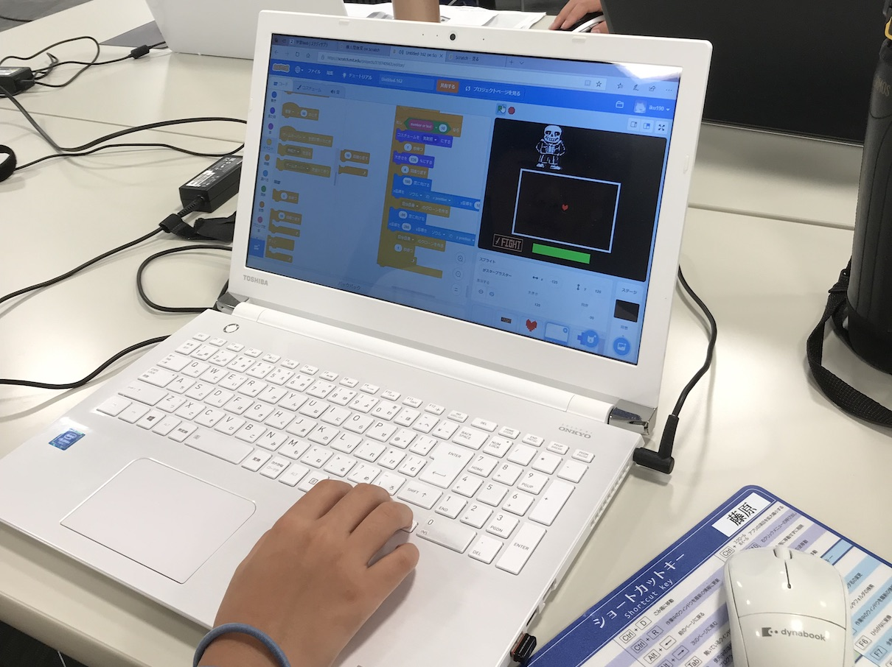
