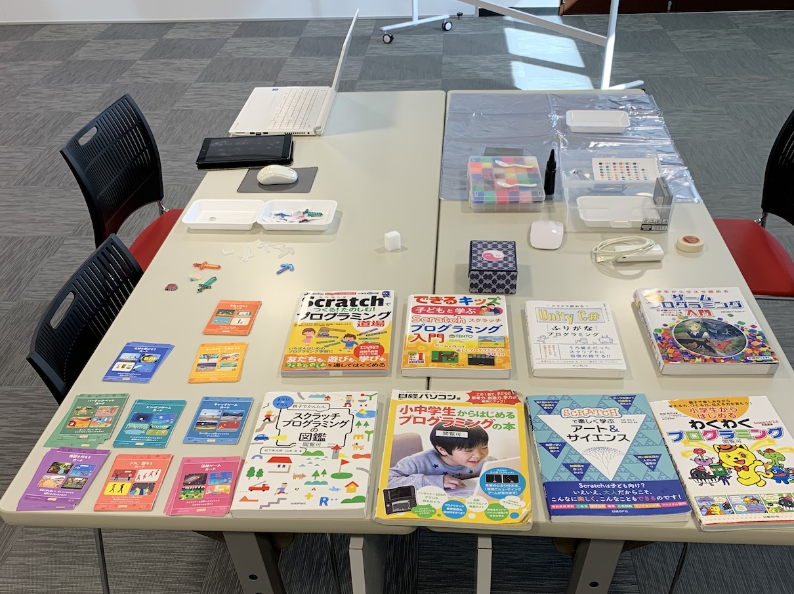
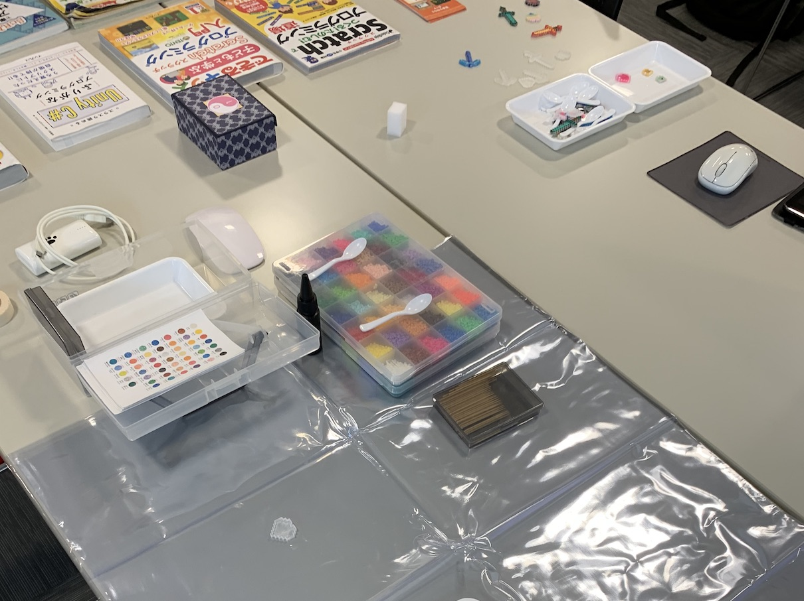
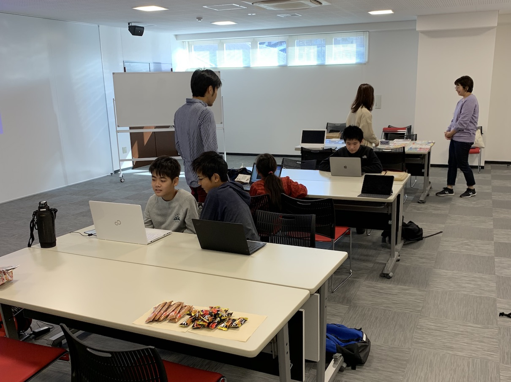
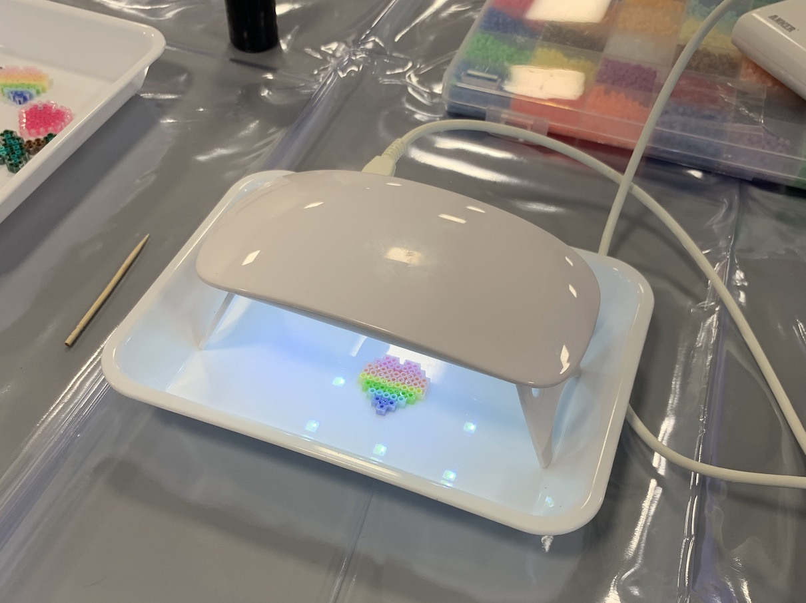
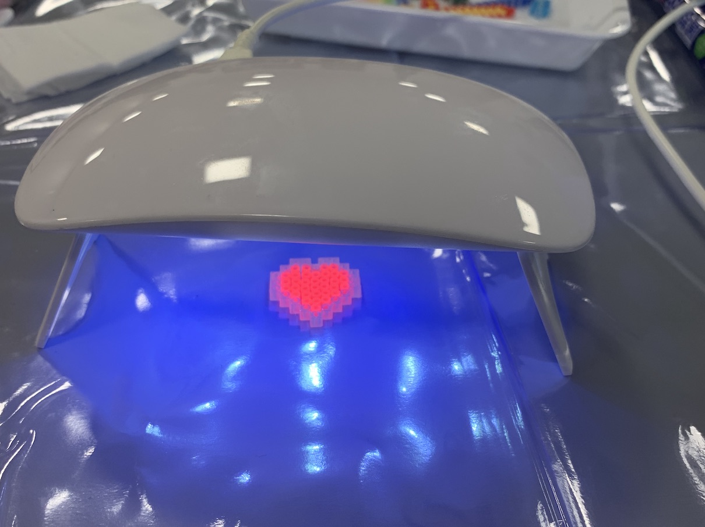
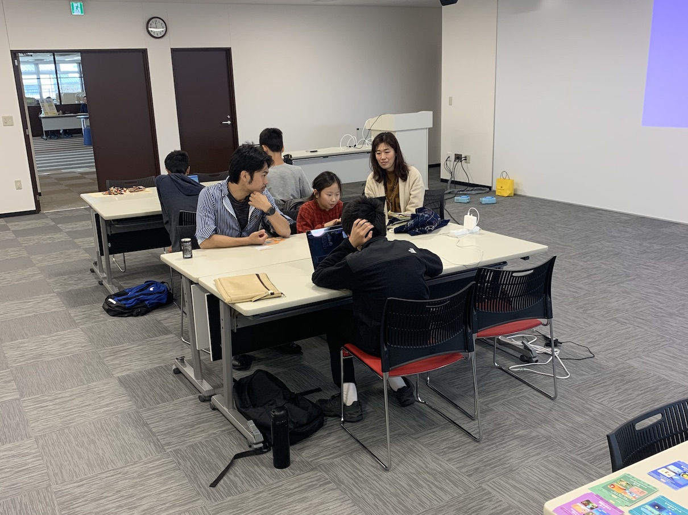
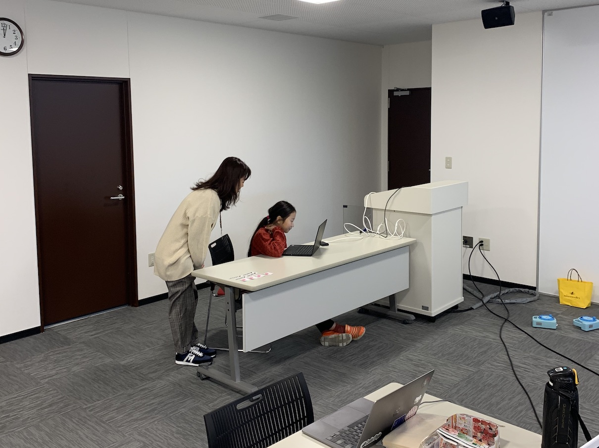
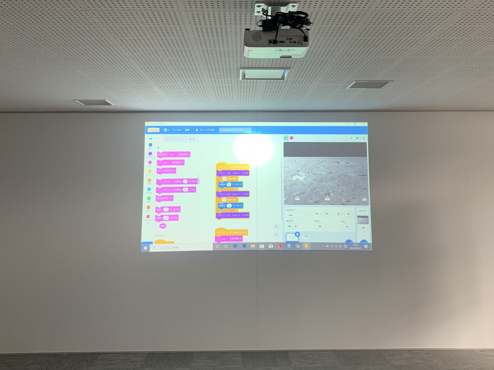
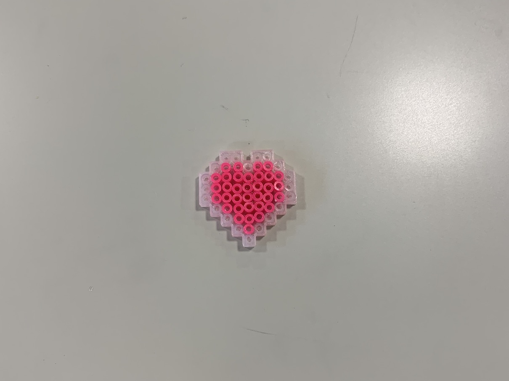

[子ども向けプログラミング道場：コーダー道場 28 回目 @大阪狭山](https://coderdojo-hommachi.doorkeeper.jp/events/99531)

`2`名の **メンター**と`4`名の **ニンジャ** が集まりました。

会場は「[UP っぷ（子育て支援・世代間交流センター）](http://www.city.osakasayama.osaka.jp/kosodate_kyoiku/kosodate/upp_kosodatesiensedaikankouryuusenta1/index.html)」にて開催させていただきました

## 当日のスケジュール ⏰

| 時間                   | 内容                      |
| ---------------------- | ------------------------- |
| 10:00 - 10:10 (10 min) | オープニング              |
| 10:10 - 11:10 (60 min) | プログラミング            |
| 11:10 - 11:30 (20 min) | 休憩                      |
| 11:30 - 11:50 (20 min) | プログラミングの続き      |
| 11:50 - 12:10 (20 min) | 作品発表                  |
| 12:10 - 12:30 (20 min) | クロージング & 交流タイム |

## レポート 📝

### オープニング 🎉

今回はプログラミングの他にビーズで遊べるコーナを企画しました。

図工のみの参加もコーダー道場 大阪狭山ではあります。✂️🔖

### プログラミング

参加者が少なくても自然と話ができる雰囲気がよいですね。

### 図工

ストライプのハート ❤️🧡💛💚💙💜

VU ライトを当てると光るビーズもあります 💖

### プログラミングの続き

音楽のプログラミングの挑戦しているニンジャは難しそうにしているのかも 🎼

### 作品発表

#### 発表１

はじめての Scratch のプログラミングで作った作品は、月でうさぎがジャンプします。

コーダー道場は初めての参加でしたが、発表までしてくれました。(餅を飛び越えるモーションがかわいい)

### クロージング

ビーズ遊びも人気なので、図工だけの参加者も楽しめてそうです。

