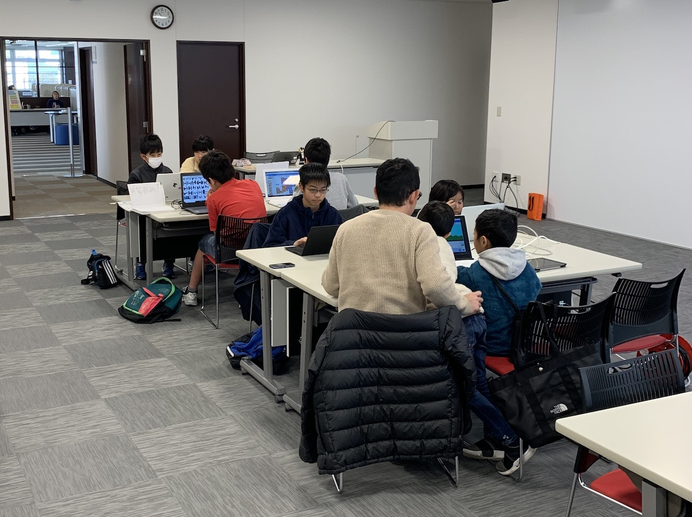
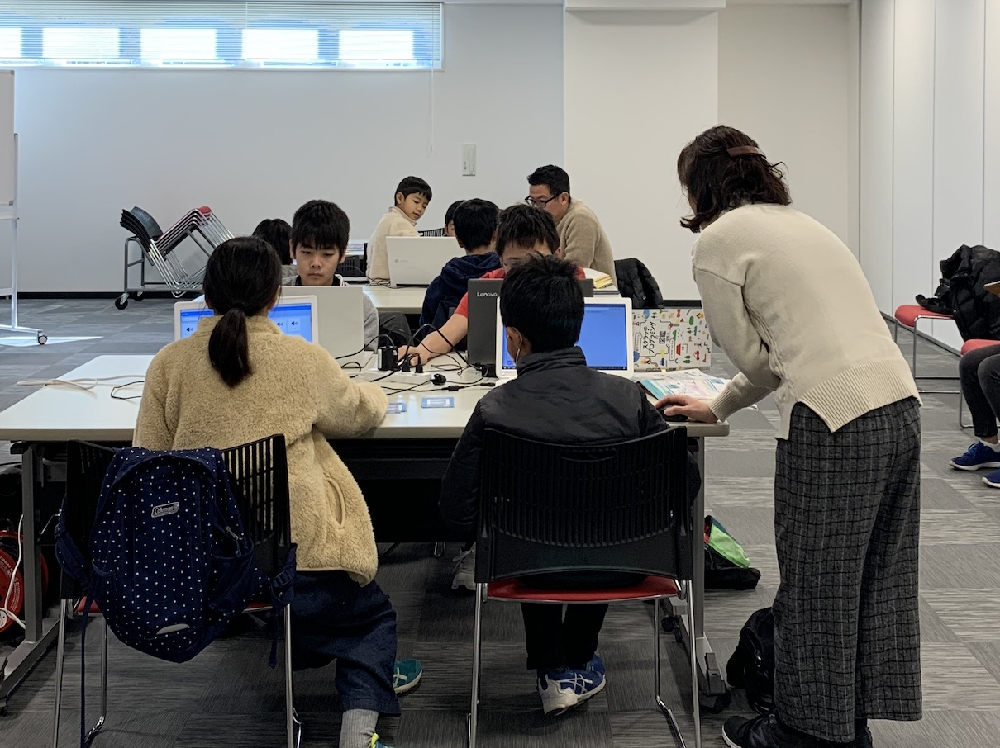
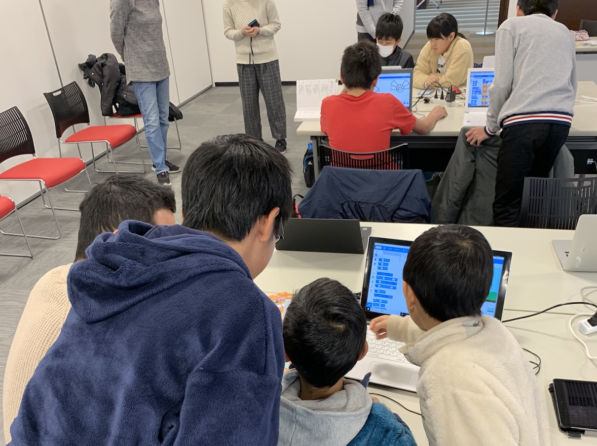
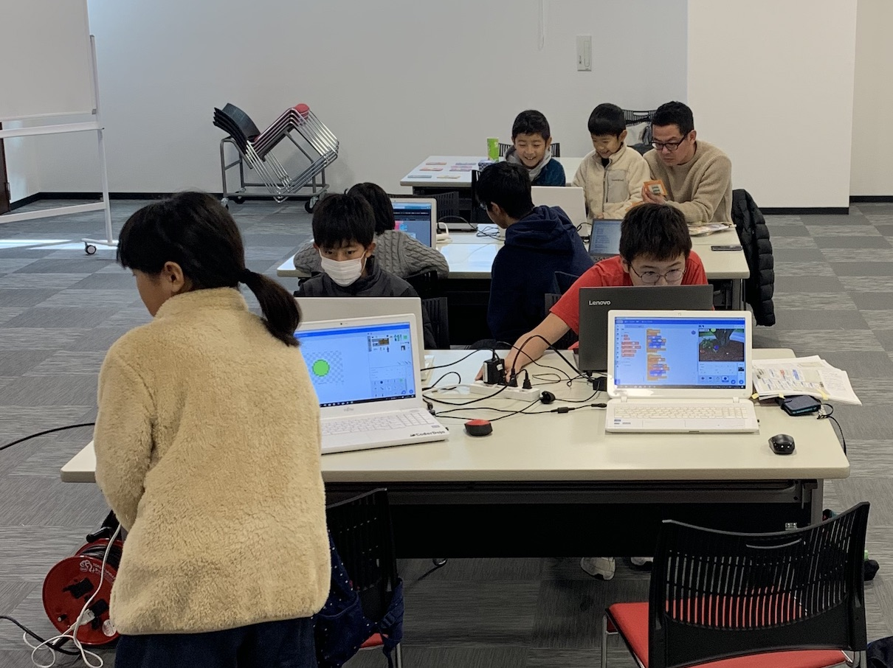
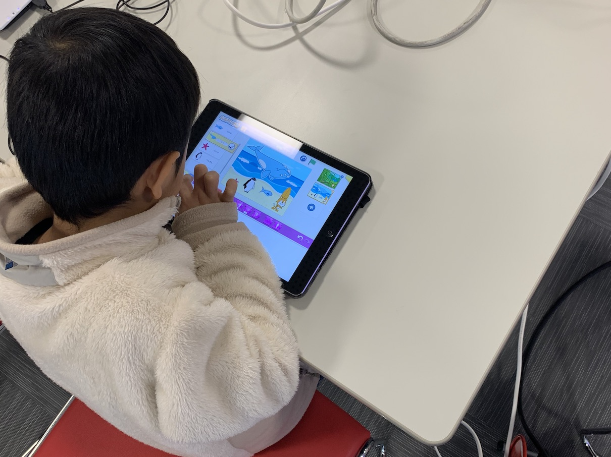
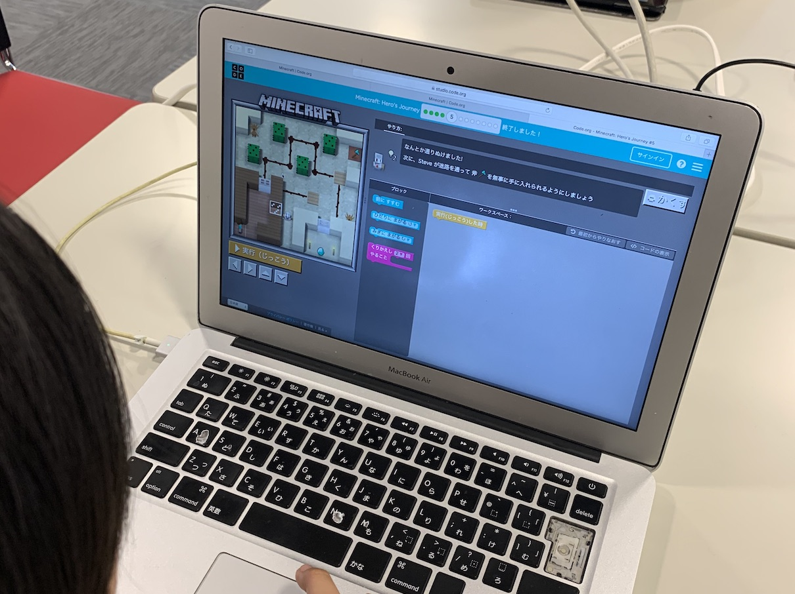
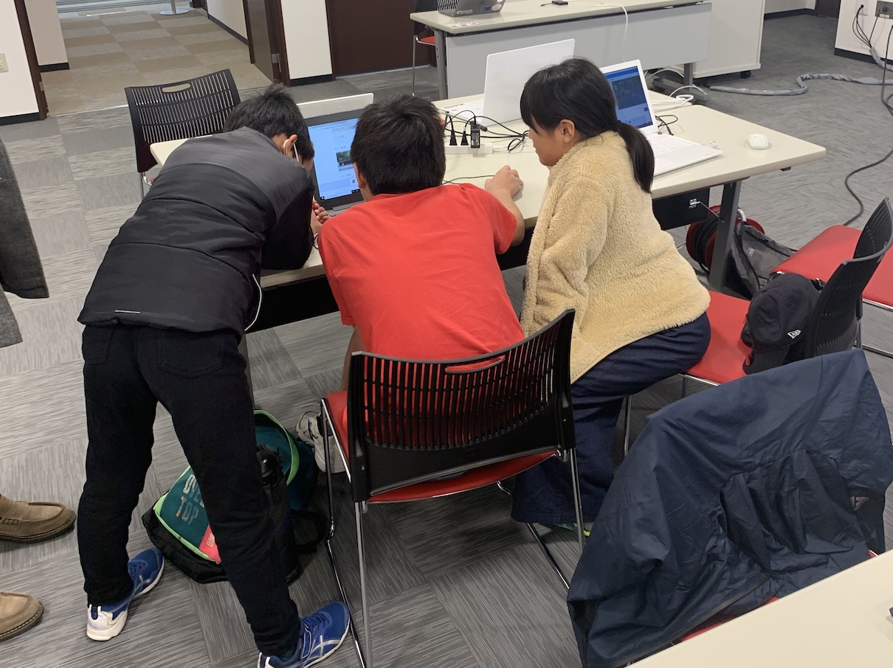

[子ども向けプログラミング道場：コーダー道場 30 回目 @大阪狭山](https://coderdojo-hommachi.doorkeeper.jp/events/99533)

`2`名の **メンター**と`6`名の **ニンジャ** が集まりました。

会場は「[UP っぷ（子育て支援・世代間交流センター）](http://www.city.osakasayama.osaka.jp/kosodate_kyoiku/kosodate/upp_kosodatesiensedaikankouryuusenta1/index.html)」にて開催させていただきました

## 当日のスケジュール ⏰

| 時間                   | 内容                      |
| ---------------------- | ------------------------- |
| 10:00 - 10:10 (10 min) | オープニング              |
| 10:10 - 11:10 (60 min) | プログラミング            |
| 11:10 - 11:30 (20 min) | 休憩                      |
| 11:30 - 12:10 (40 min) | プログラミングの続き      |
| 12:10 - 12:30 (20 min) | クロージング & 交流タイム |

## レポート 📝

### オープニング 🎉

まだお正月ムードでいつもりゆったりとした感じです。

冬休みはあまりプログラミングに時間がとれなかったみたい。

### プログラミング

はじめての参加者はユースメンターが活躍してくれます。

楽しそうだったり、真剣そうっだったり、夢中になってます。

### プログラミングの続き

ScratchJr は Scratch を始める前にしているとよさそう。

Scratch になれてきたら Minecraft Hour of Code もいいね！

### クロージング

今回は発表のないコーダー道場でしたが、公園の遊ぶ感じでよかったかも。

