[子ども向けプログラミング道場：コーダー道場 38 回目 @大阪狭山](https://coderdojo-hommachi.doorkeeper.jp/events/113100)

`3`名の **メンター** と`7`名の **ニンジャ** が集まりました。

会場は「[UP っぷ（子育て支援・世代間交流センター）](http://www.city.osakasayama.osaka.jp/kosodate_kyoiku/kosodate/upp_kosodatesiensedaikankouryuusenta1/index.html)」にて開催させていただきました。

## 当日のスケジュール

⏰

| 時間                   | 内容                       |
| ---------------------- | -------------------------- |
| 10:00 - 10:10 (10 min) | オープニング               |
| 10:10 - 11:10 (60 min) | プログラミング、図工       |
| 11:10 - 11:20 (10 min) | 休憩                       |
| 11:20 - 12:00 (40 min) | プログラミング、図工の続き |
| 11:50 - 12:10 (20 min) | 図工の続き                 |
| 12:10 - 12:30 (20 min) | クロージング               |

## レポート

### オープニング

横一列の配置のスタイルも定着してきました。座っている位置も定着しているかも 🤔

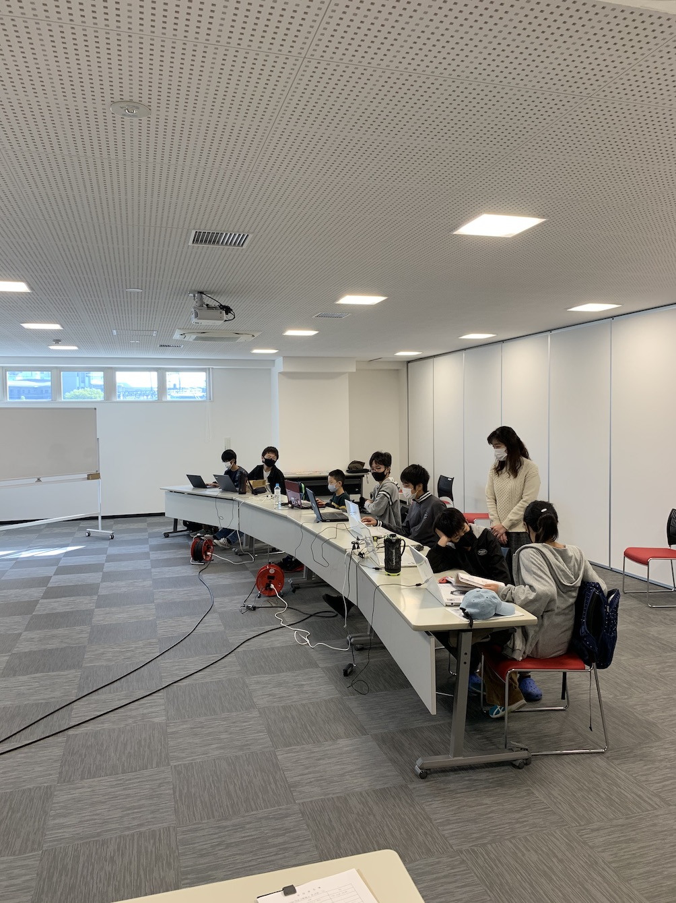

UV レジンの図工セットを準備しました。だんだんモールドが増えてきています。

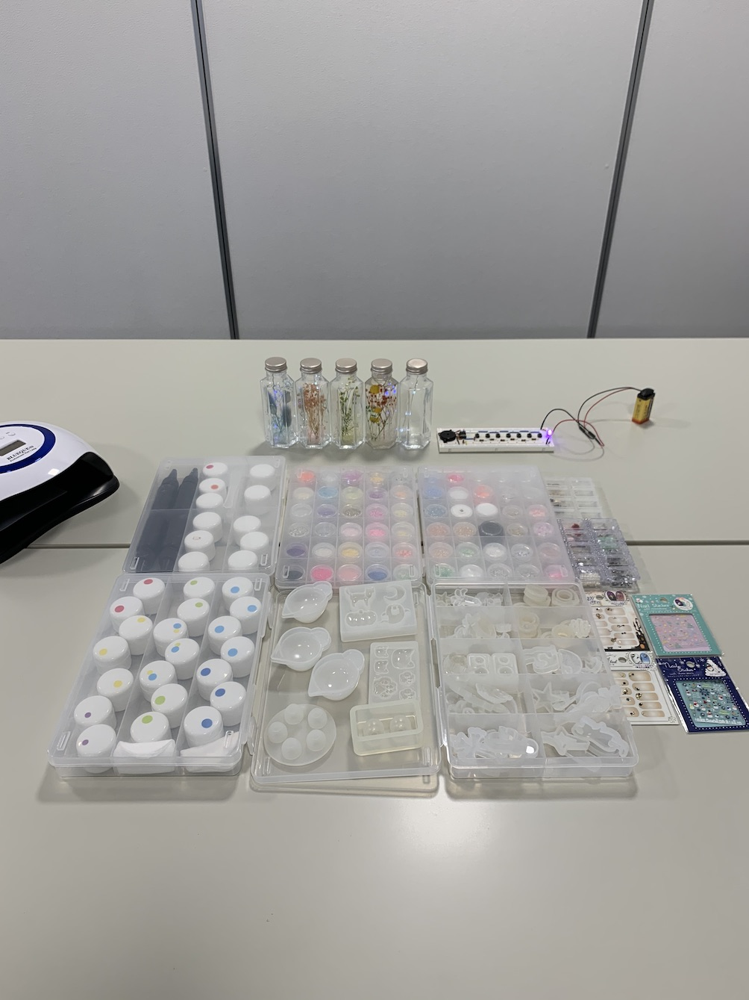

#### さやりん

大阪狭山市のマスコットキャラクターの さやりん がブログやチラシに使える許可がでました。 🎊

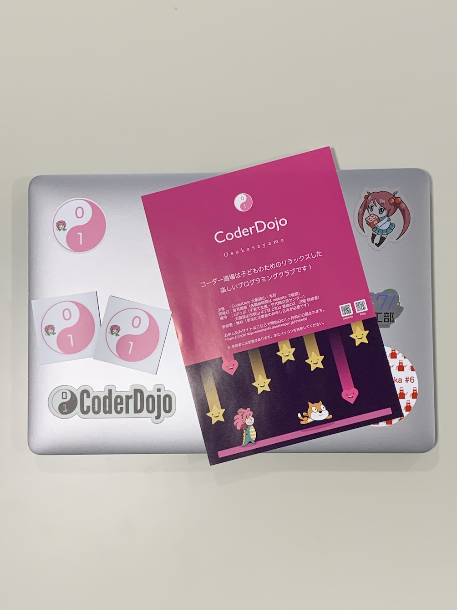

ステッカーも さやりん バージョンを作ったので作品発表のプレゼントにします。 🎁

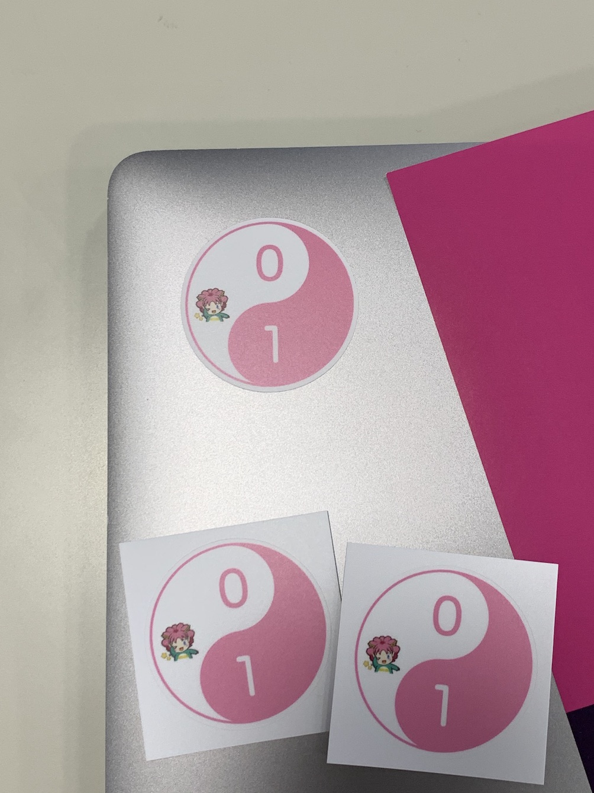

### プログラミング、図工

ソーシャルディスタンスの対策で図工は一人づつ作っています。手袋はレジンの付着防止で以前からしていました。 🧤

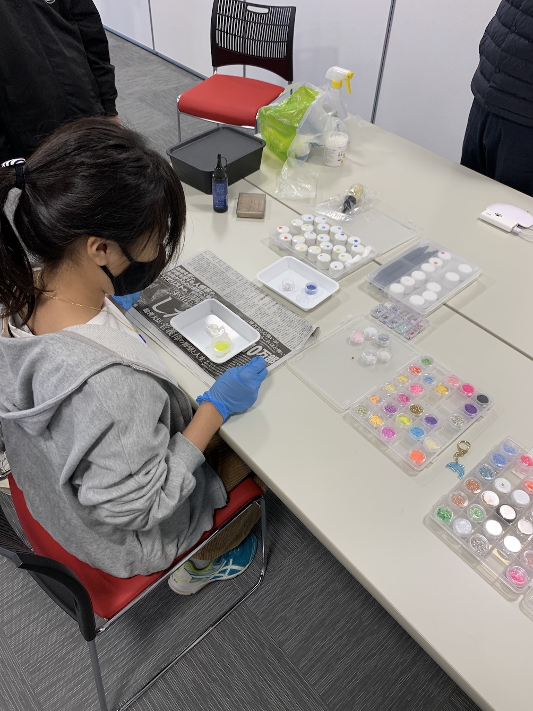

持参したモールドで作品を作っています。同じものを 2 つ作って張り合わせるのは難しそう

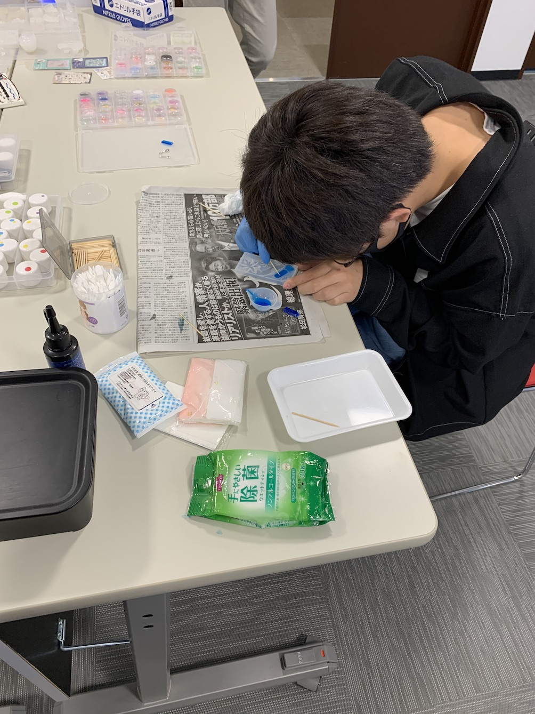

### プログラミング、図工の続き

この写真ではありませんが、Unity で迷路 や Scrach のアクションをプログラミングしています。

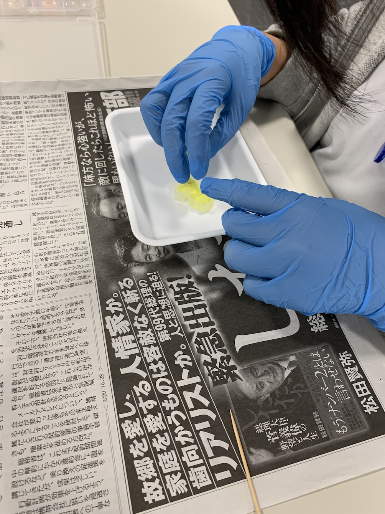

あまったレジンでシャケの切り身を作りました。皮は青色で身は黄色です。 🐠

### 作品展示

#### 展示１

UV レジンで作ったイルカとウサギです。両方とも目が宝石でかわいい。 🐬 🐰

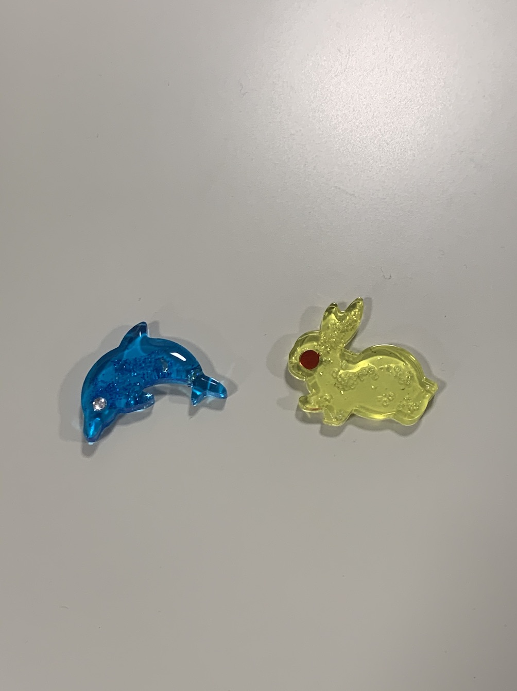

UV レジンで作ったクリスタルです。3 つ作ったので上達がはやいです。 💎

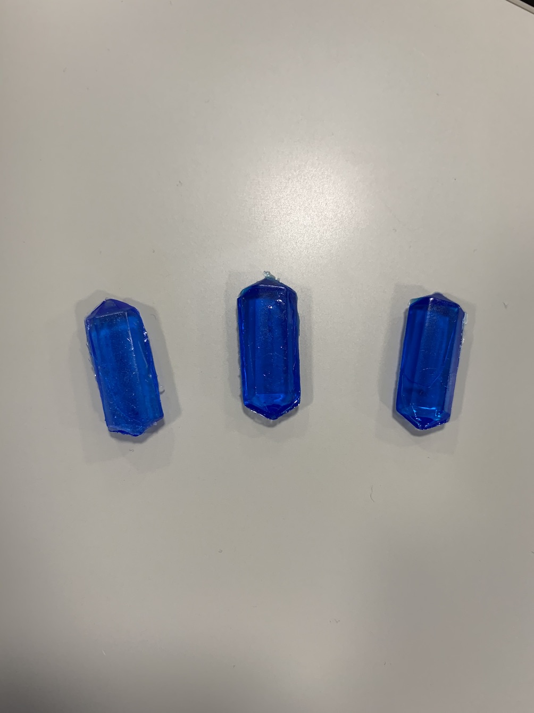

#### 展示２

メンターの光るハーバリウムです。ボトルの中栓に電池ケースとスイッチが入っています。 🔮

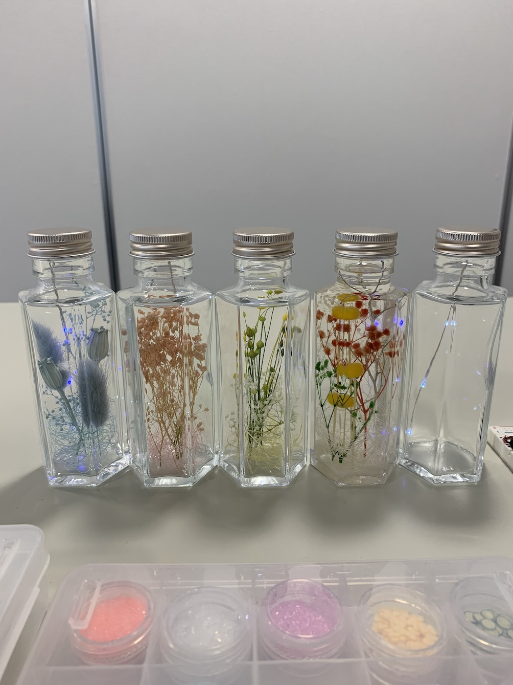

暗くすると優しく光っています。（移動が大変なのでオイルが入っているのは、この中のひとつです。）

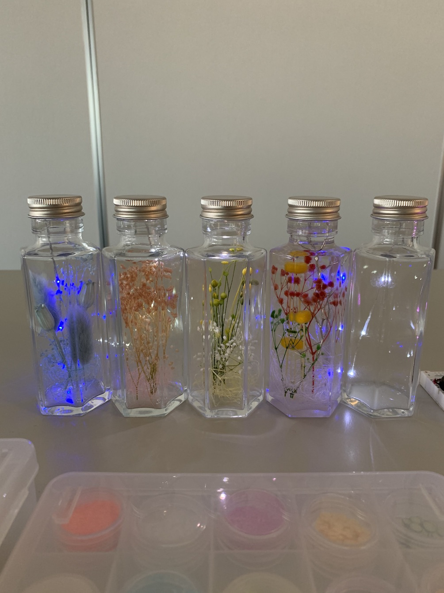

#### 展示３

こちらもメンターのガーデニングライトを分解して取り付けた メイソンジャー です。 ✨

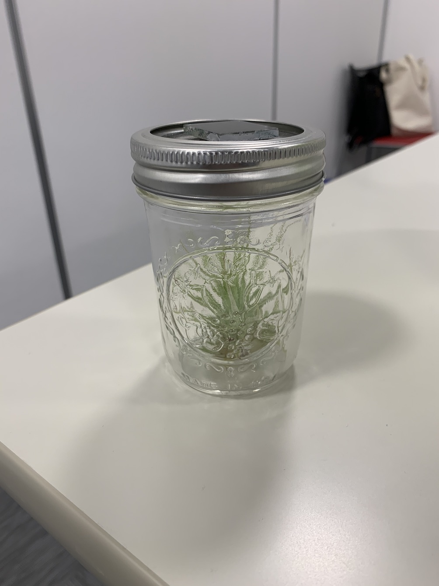

こどもたちは少ないパーツで蓄電式のライトができていると驚いていました。

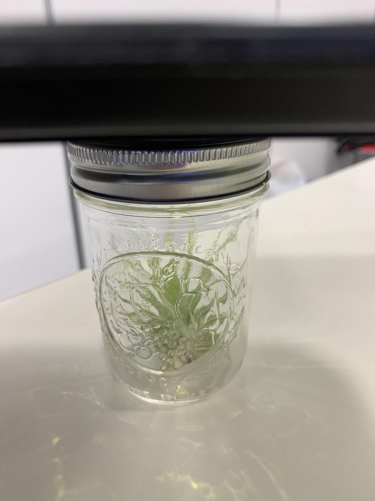

### クロージング

開催中に市から図工イベントの開催の話があって、親子で参加できるスタイルのイベントを企画できそうです。

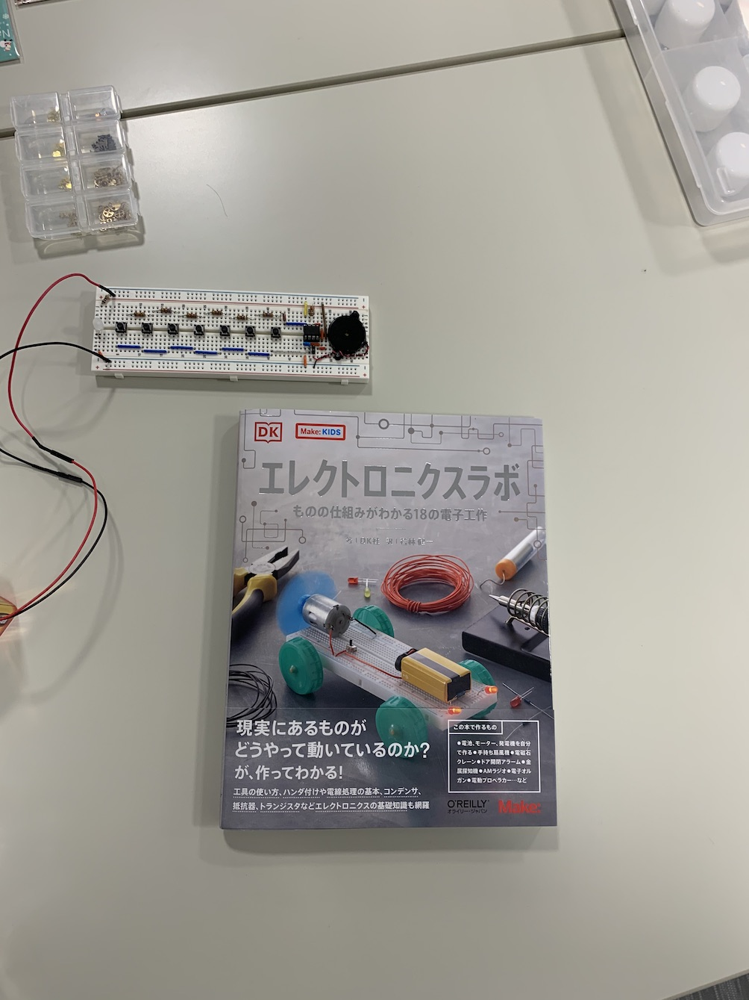
