[子ども向けプログラミング道場：コーダー道場 40 回目 @大阪狭山](https://coderdojo-hommachi.doorkeeper.jp/events/115182)

`3`名の **メンター** と`4`名の **ニンジャ** が集まりました。

会場は「[UP っぷ（子育て支援・世代間交流センター）](http://www.city.osakasayama.osaka.jp/kosodate_kyoiku/kosodate/upp_kosodatesiensedaikankouryuusenta1/index.html)」にて開催させていただきました。

## 当日のスケジュール

⏰

| 時間                   | 内容                      |
| ---------------------- | ------------------------- |
| 10:00 - 10:10 (10 min) | オープニング              |
| 10:10 - 11:10 (60 min) | プログラミング            |
| 11:10 - 11:20 (10 min) | 休憩 (自由)               |
| 11:20 - 12:05 (45 min) | プログラミングの続き      |
| 12:05 - 12:25 (20 min) | 作品発表                  |
| 12:25 - 12:35 (10 min) | クロージング & 交流タイム |

## レポート

### オープニング

市の施設側で検温や消毒の対応して頂いているおかげで、いつものオフラインで開催ができました。

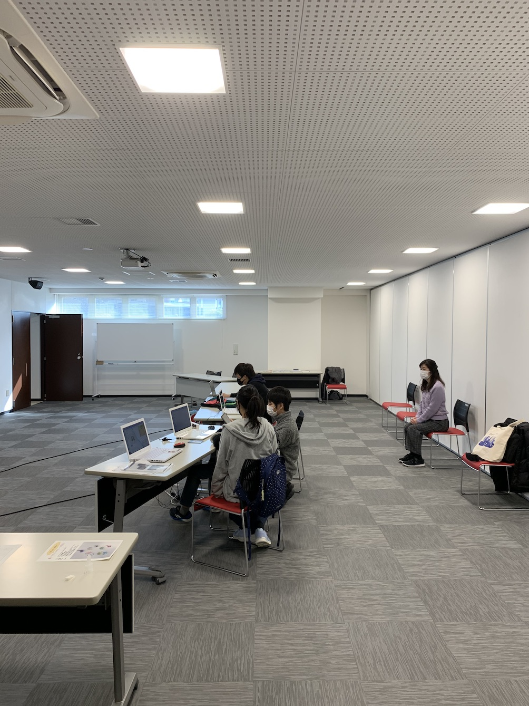

### プログラミング

プログラミングをしているときはそれぞれの PC に黙々としているので、音楽がないと静かです。 🎼

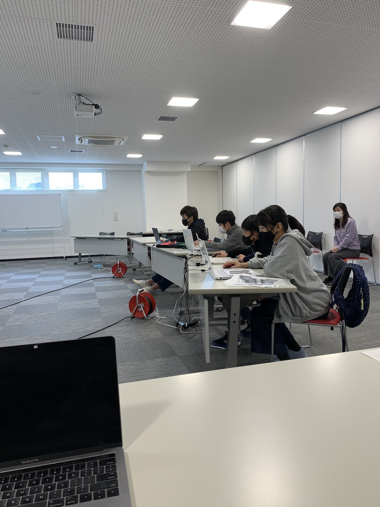

発表の準備はいつも 12 時前後になるので、お腹がすく時間かも 🍞

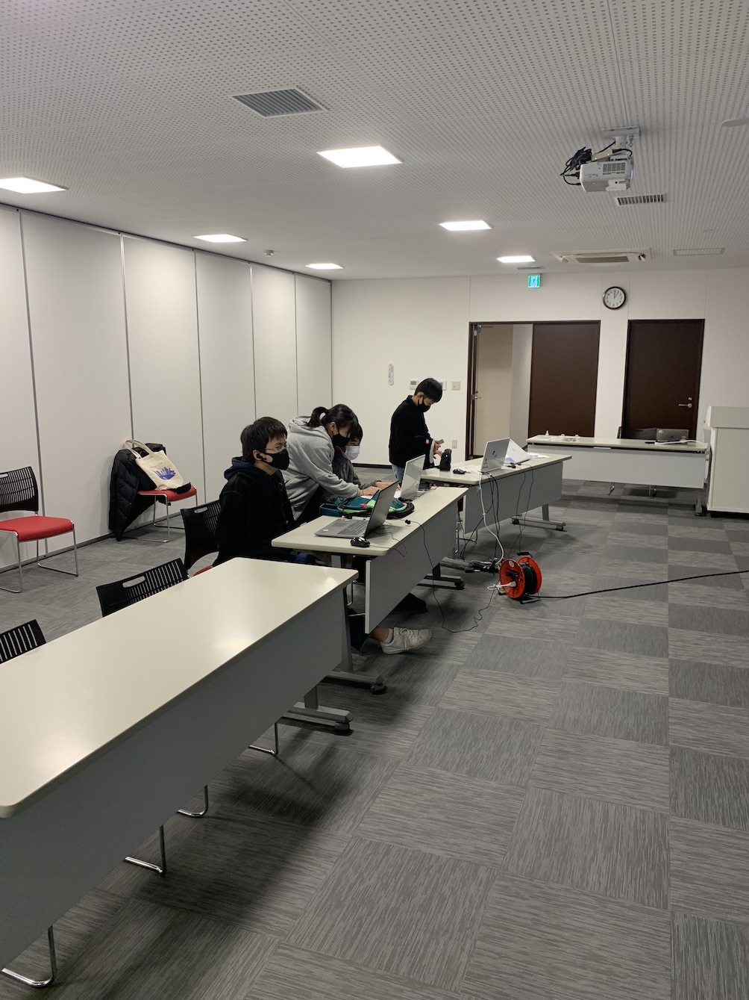

### 作品発表

#### 発表１

メンターの 光造形 3D プリンター の作品です。マイクラのソードを印刷しました。 🗡

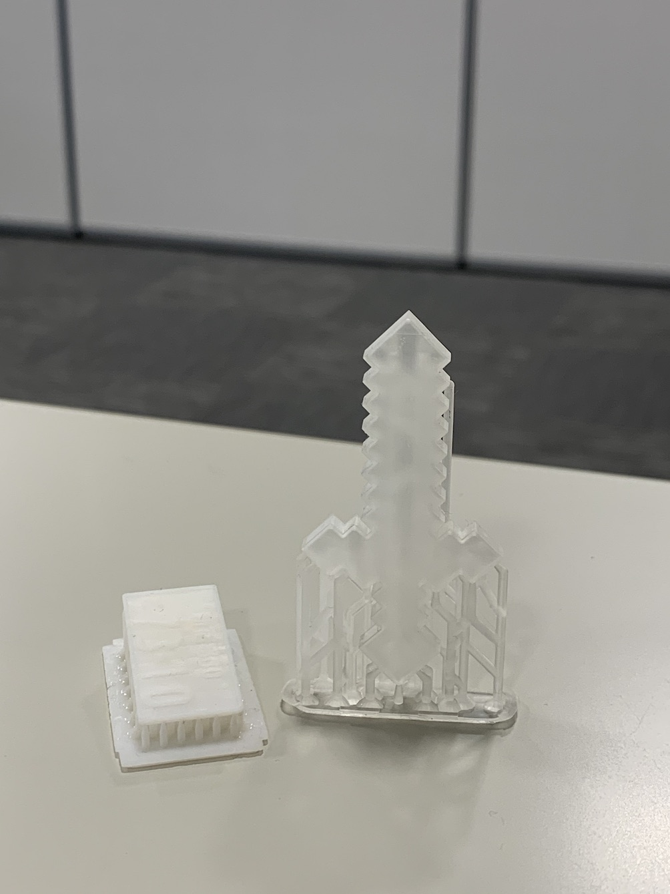

印刷するときのスライサーの[CHITUBOX](https://www.chitubox.com/en) の紹介です。（CHITUBOX は無料で使用できます。）

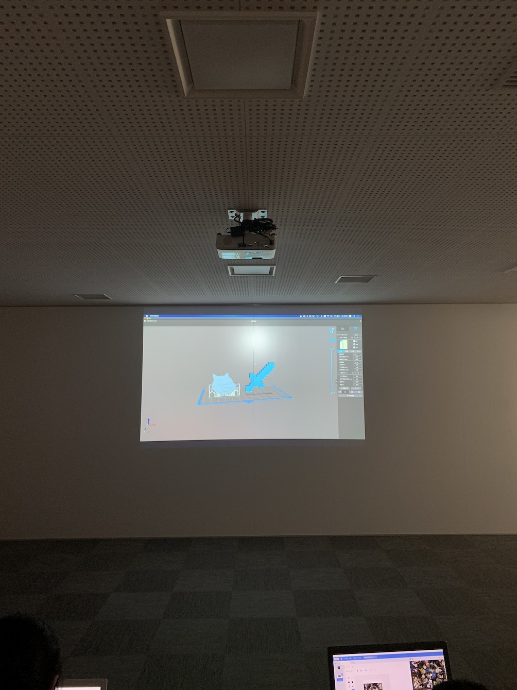

#### 発表２

Scratch で画像を加工する方法を紹介です。 🎨 （なれたツールを使うのが楽ですね。）

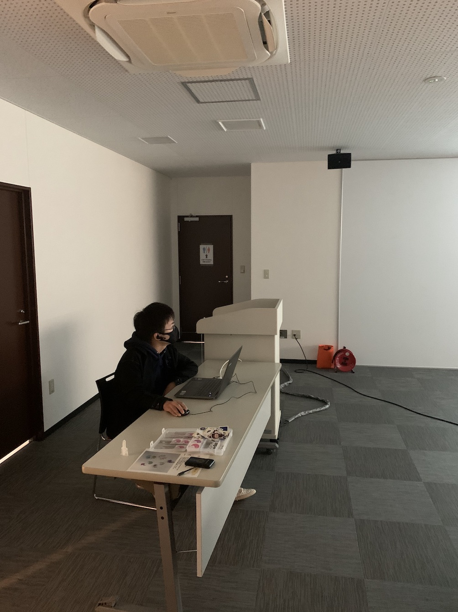

スポイトツールや円形ツールを使うと残したい画像以外をマスクするのが簡単にできます。

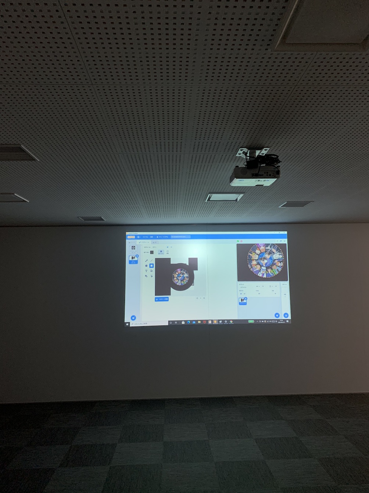

#### 発表３

Scratch のマイクラのイラストです。イラストは 40 を超えているそうです。 🎨

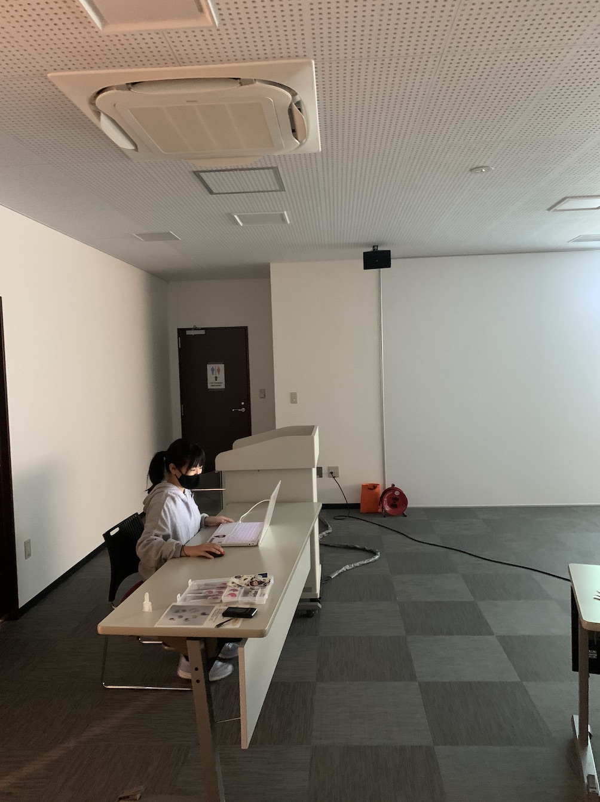

光造形 の 3D プリンターで印刷しても面白いかも（SVG 形式に保存できるからできそう。）

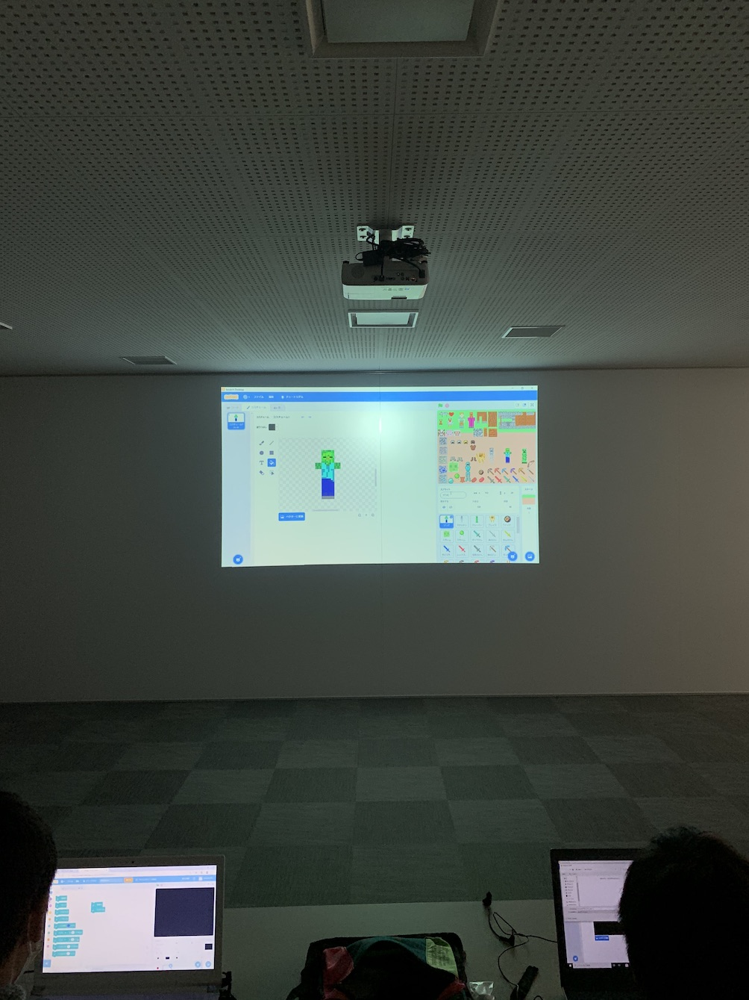

#### 発表４

Scratch のパズルゲームです。ねこの頭が左右に移動するので胴体に近づけて止めると高得点になります。

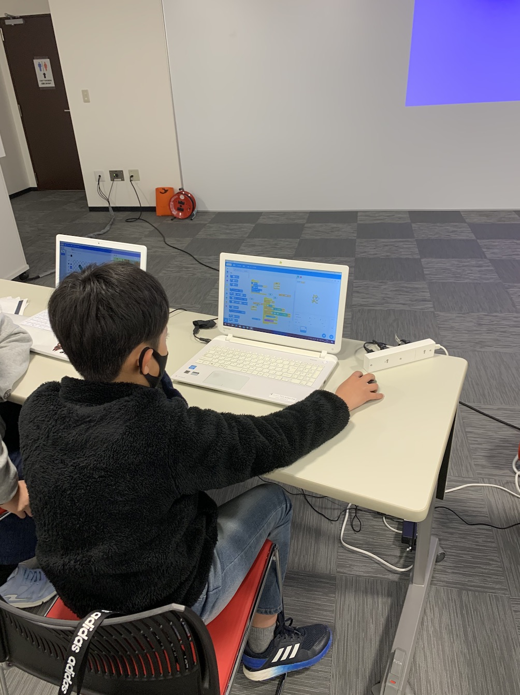

ハイスコアを 100 点にしたいけど、うまくいかないと悩んでいたいのでみんなで案を出し合いました。 💯

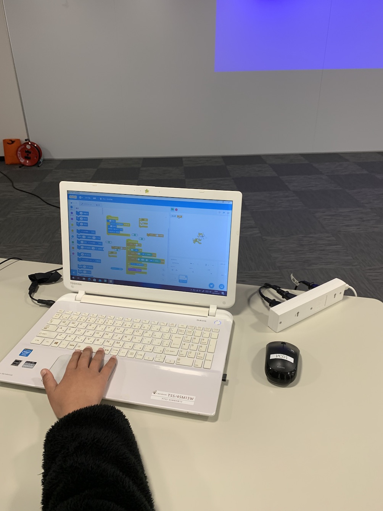

### クロージング

発表後にメンターがハイスコアの問題を比例式で説明をしています。

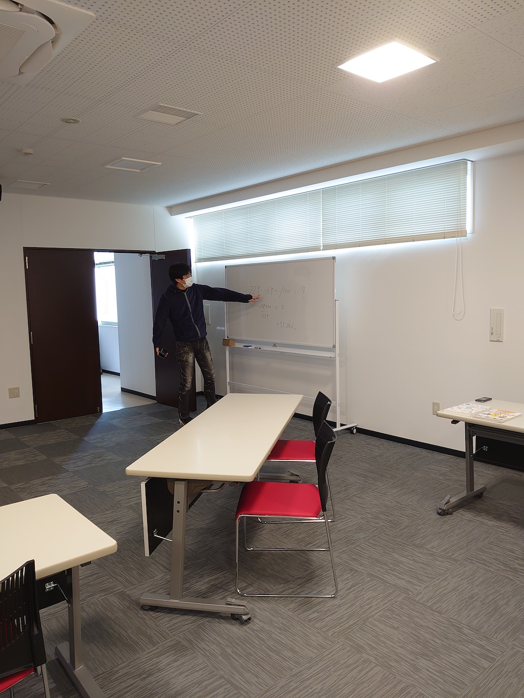

最後はユースメンターがニンジャにアドバイスをして解決したようです。 🎉

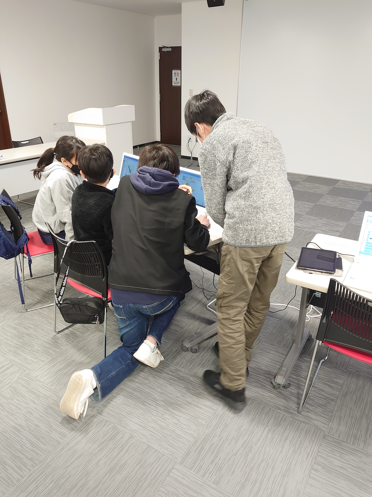
