[子ども向けプログラミング道場：コーダー道場 41 回目 @大阪狭山](https://coderdojo-hommachi.doorkeeper.jp/events/117065)

`3`名の **メンター** と`6`名の **ニンジャ** が集まりました。

会場は「[UP っぷ（子育て支援・世代間交流センター）](http://www.city.osakasayama.osaka.jp/kosodate_kyoiku/kosodate/upp_kosodatesiensedaikankouryuusenta1/index.html)」にて開催させていただきました。

## 当日のスケジュール

⏰

| 時間                   | 内容                      |
| ---------------------- | ------------------------- |
| 10:00 - 10:10 (10 min) | オープニング              |
| 10:10 - 11:10 (60 min) | プログラミング            |
| 11:10 - 11:20 (10 min) | 休憩                      |
| 11:20 - 12:00 (40 min) | プログラミングの続き      |
| 12:00 - 12:30 (30 min) | 作品発表                  |
| 12:30 - 12:35 (5 min)  | クロージング & 交流タイム |

## レポート

### オープニング

新規の参加者はしばらくありませんが、この開催のスタイルが平常になってきたので定員を増やせそうです。 ✨

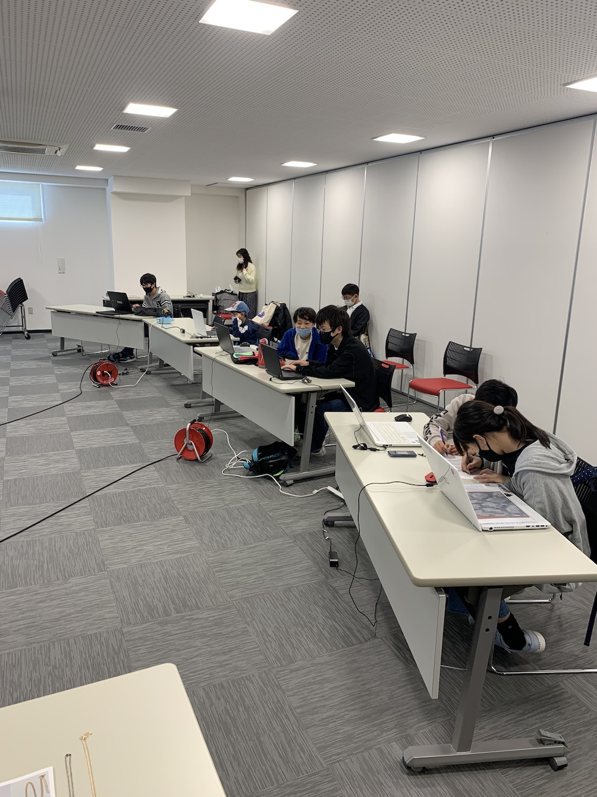

メンターが作成した図工の冊子を展示しています。
[でかドージョー](https://decadojo.coderdojo.jp/)のイベントで企画しているのでいつかやりたい。

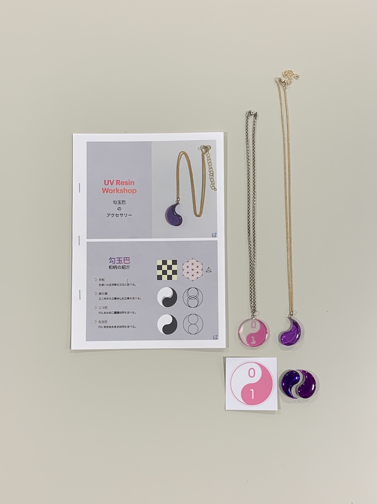

### プログラミング

子供たち同士でも盛り上がっていますが、保護者同士でも盛り上がっているようです。 👨‍👩‍👦 👨‍👩‍👧

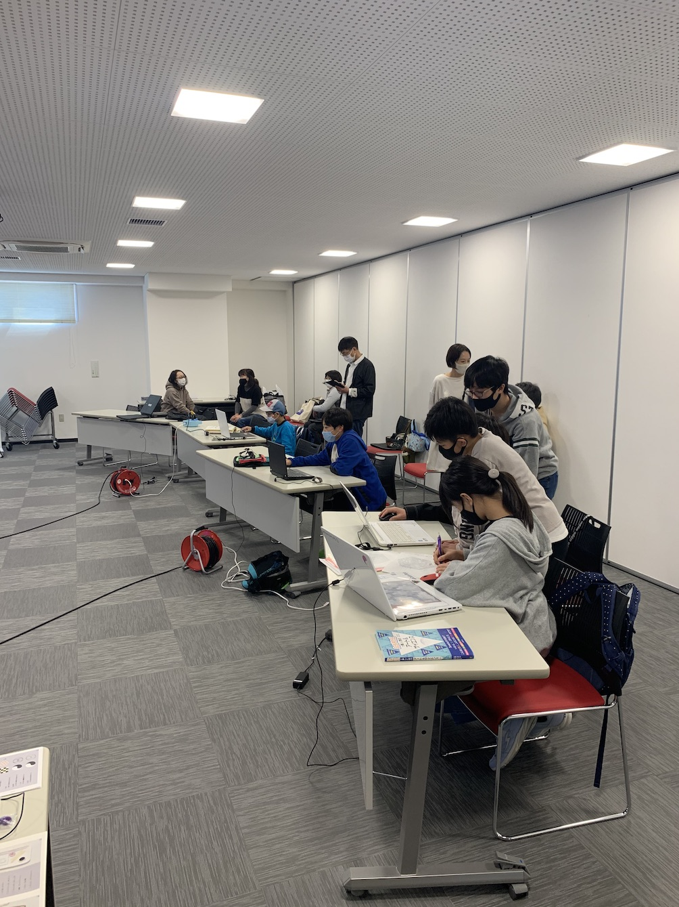

パソコンの画面と目が近いくらい真剣にプログラミンをしています。 👨‍💻👨‍💻

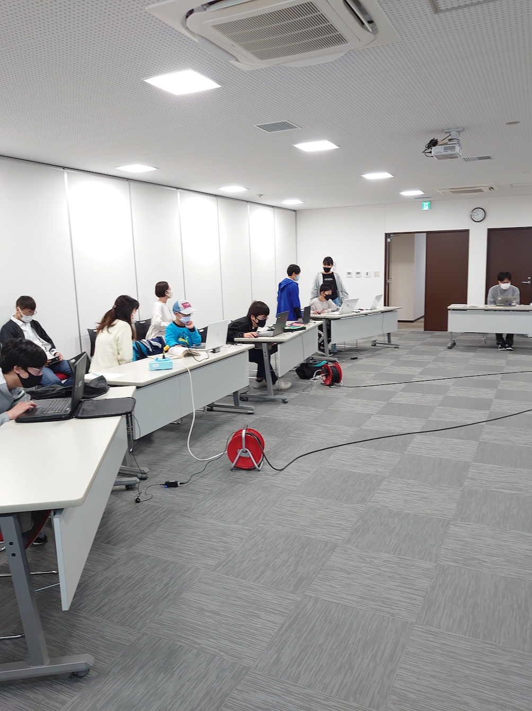

### 作品発表

#### 発表１

図工の手順書もプログラミングのひとつなので、メンターが冊子の説明をしています。

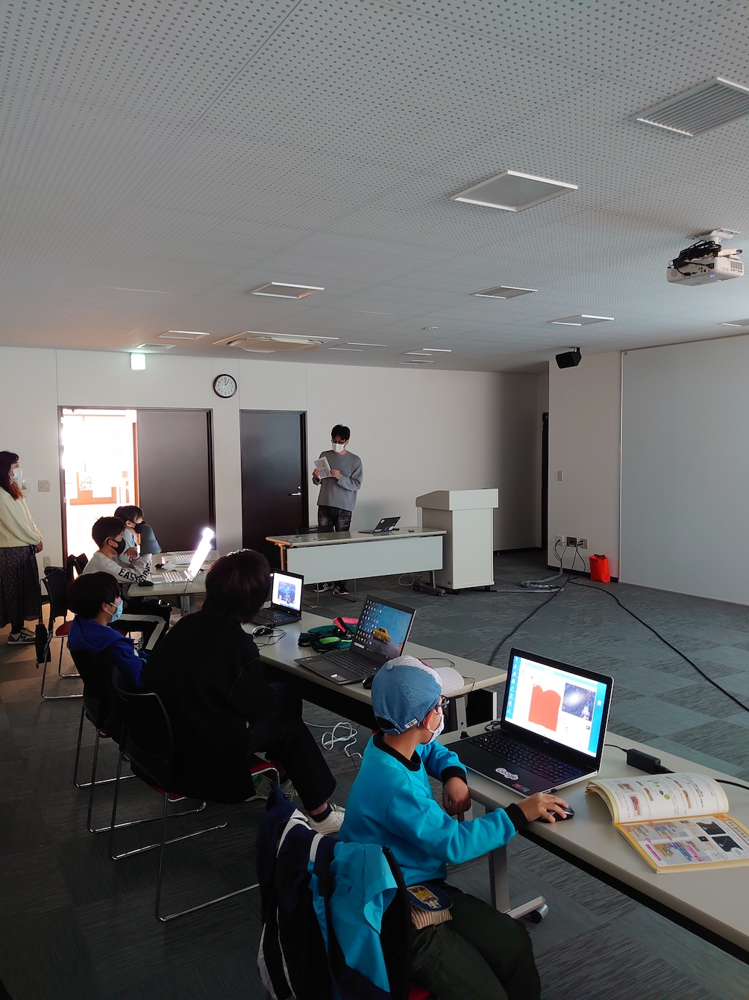

和柄の`市松`や`麻の葉`などの紹介です。マイクラ好きからは`市松`はドット絵らしいです。 🏁

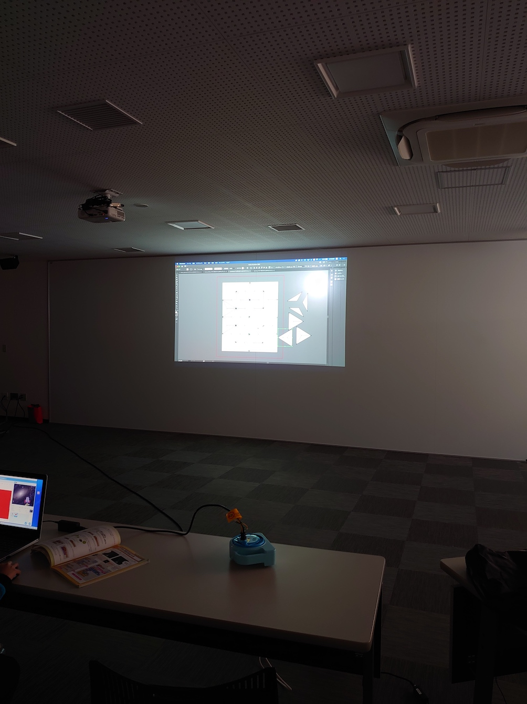

コーダー道場のロゴは和柄では`勾玉巴`が近いかも。 ☯️ (スライドの提供があると GIF で公開できるのでアップ)

#### 発表２

Scratch のアクションゲームです。２人で対戦することができます。 🐱🗡

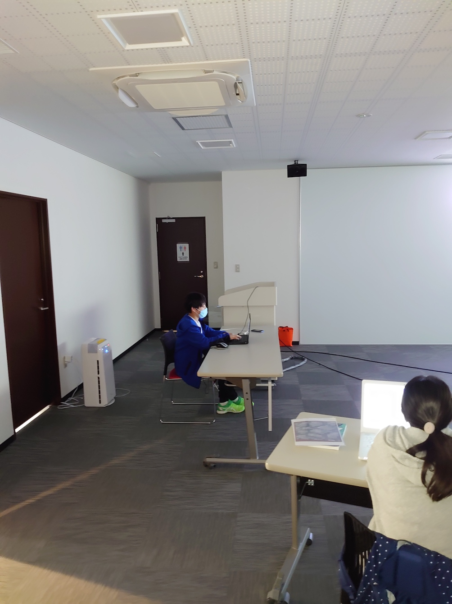

ジャンプで攻撃を交わすことができて、攻撃が当たった時はコステュームが変わります。

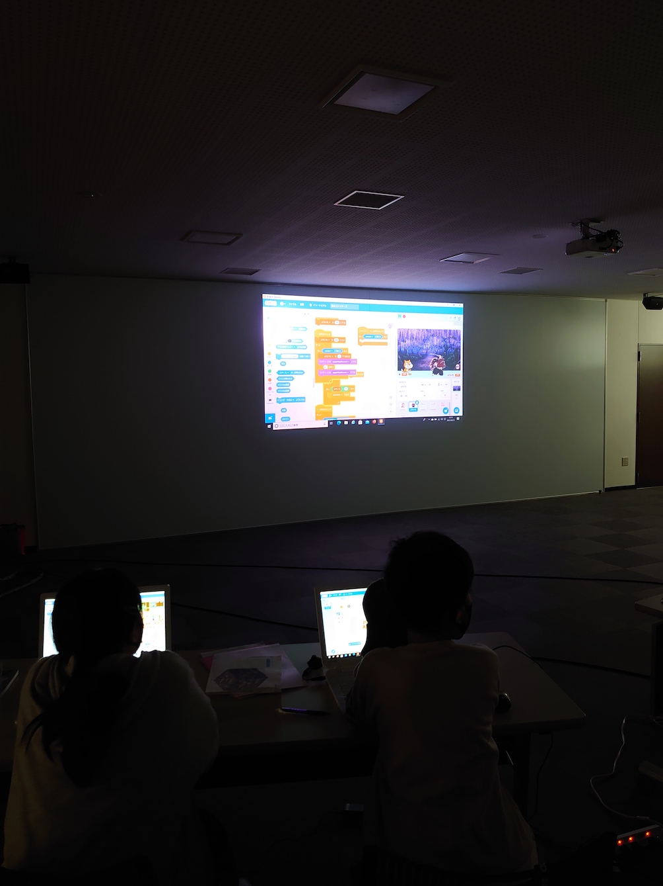

まだ作り始めのようなのでこれからが楽しみ、背景もいい感じです。

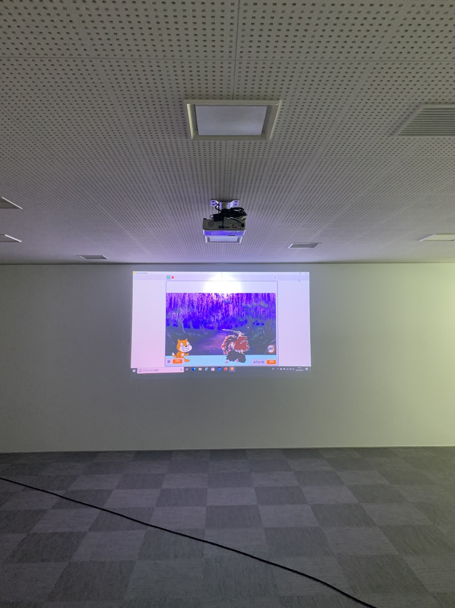

#### 発表３

Scratch のアニメーションとシューティングゲームです。

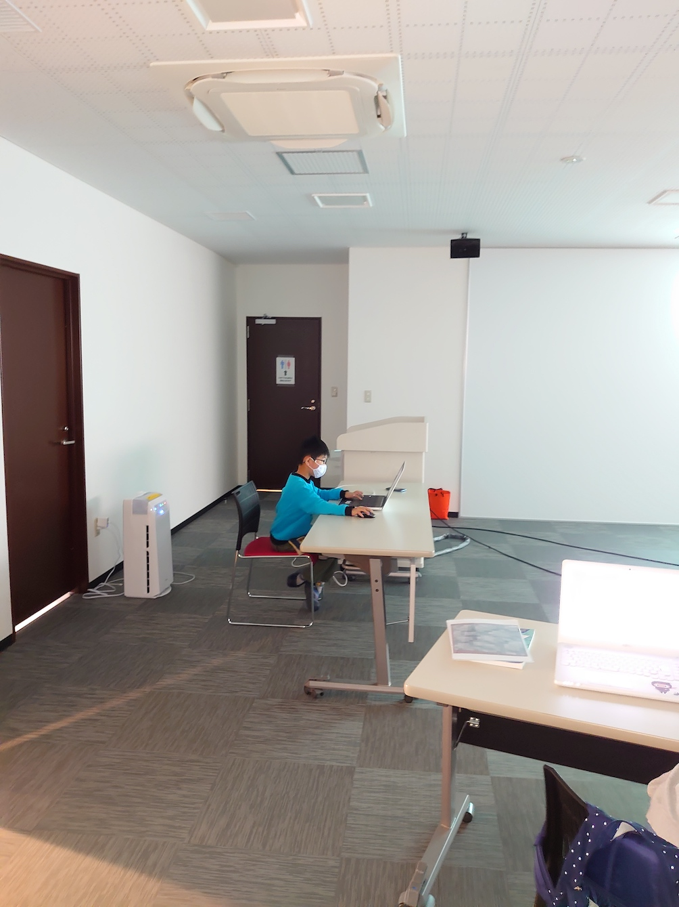

バットを振ると、その後も超速でバットを降り続けていましたが、それがウケていました。 ⚾️

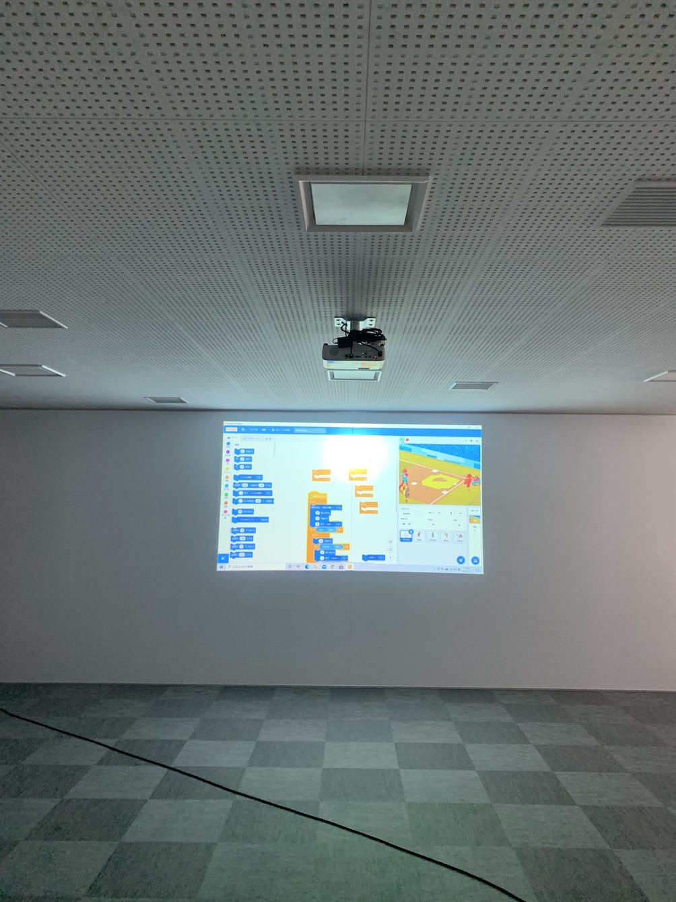

いろんな作品を作っているようで２つ目の発表もしてくれました。 🚀

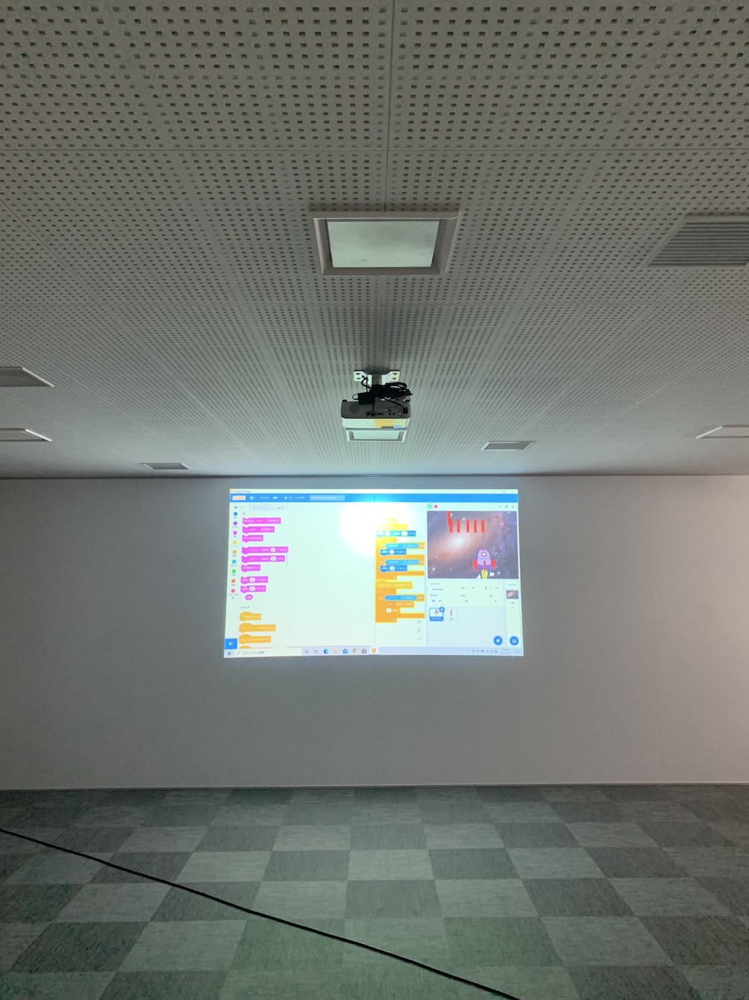

### クロージング

中学生は学年末試験の直前で発表がなかったけど、3 月の開催は春休みになるから時間があるかな 🤔
